# 🏗️ Enterprise Multi-MCP Smart Database System Architecture

> **Next-Generation Database Architecture: From SQL to Natural Language Intelligence**

## 📋 Table of Contents

1. [Architecture Overview](#-architecture-overview)
2. [Core Components](#-core-components)
3. [Data Flow Architecture](#-data-flow-architecture)
4. [Intelligence Layer](#-intelligence-layer)
5. [Multi-MCP Framework](#-multi-mcp-framework)
6. [Scalability & Performance](#-scalability--performance)
7. [Security Architecture](#-security-architecture)
8. [Deployment Architecture](#-deployment-architecture)

## 🌟 Architecture Overview

The Enterprise Multi-MCP Smart Database System represents a revolutionary approach to data management, combining traditional database reliability with artificial intelligence, natural language processing, and distributed systems engineering.

### 🎯 **Design Principles**

1. **Intelligence-First**: Every component leverages AI/ML for optimization
2. **Natural Language Native**: SQL elimination through advanced NLP
3. **Thermal Data Management**: Hot/cold data classification for optimal performance
4. **Self-Organizing**: Autonomous topology optimization and scaling
5. **Fault-Tolerant**: Byzantine fault tolerance with distributed consensus
6. **Zero-Administration**: Self-healing and self-optimizing operations

### 🏛️ **Architectural Layers**

```mermaid
graph TB
    subgraph "🌐 Layer 1: Enterprise Gateway"
        direction TB
        LB[Load Balancer<br/>🔄 Traffic Distribution]
        API[API Gateway<br/>🚪 Unified Entry Point]
        AUTH[Authentication Service<br/>🔐 Zero-Trust Security]
        RATE[Rate Limiter<br/>🛡️ DDoS Protection]
    end
    
    subgraph "🧠 Layer 2: RAG Intelligence"
        direction TB
        RAG1[RAG₁ Ingestion Engine<br/>🤖 AI Data Classification]
        RAG2[RAG₂ Query Engine<br/>💬 Natural Language Interface]
        ML[ML Models<br/>🎯 Pattern Recognition]
        INTEL[Intelligence Coordinator<br/>🧠 Cross-Component Learning]
    end
    
    subgraph "🎛️ Layer 3: Registry & Orchestration"
        direction TB
        REG[Central MCP Registry<br/>🗂️ Service Discovery]
        ORCH[MCP Orchestrator<br/>⚙️ Lifecycle Management]
        HEALTH[Health Monitor<br/>📊 Real-time Monitoring]
        MIG[Migration Engine<br/>🔄 Automated Data Movement]
    end
    
    subgraph "🔥❄️ Layer 4: Multi-MCP Instance"
        direction LR
        subgraph "🔥 HOT Tier"
            USER_H[User MCP]
            CHAT_H[Chat MCP]
            STATS_H[Stats MCP]
            SESSION_H[Session MCP]
        end
        subgraph "❄️ COLD Tier"
            LOGS_C[Logs MCP]
            ARCHIVE_C[Archive MCP]
            HISTORY_C[History MCP]
            BACKUP_C[Backup MCP]
        end
    end
    
    subgraph "⚡ Layer 5: Infrastructure"
        direction TB
        KAFKA[Event Stream<br/>📨 Inter-MCP Communication]
        REDIS[Cache Layer<br/>⚡ Multi-level Caching]
        METRICS[Metrics Database<br/>📊 Performance Monitoring]
        STORAGE[Distributed Storage<br/>💾 Data Persistence]
    end
    
    LB --> API --> AUTH --> RATE
    AUTH --> RAG1 & RAG2
    RAG1 --> ML --> INTEL
    RAG2 --> REG --> ORCH
    ORCH --> USER_H & CHAT_H & STATS_H & SESSION_H
    ORCH --> LOGS_C & ARCHIVE_C & HISTORY_C & BACKUP_C
    MIG -.-> USER_H & LOGS_C
    HEALTH --> KAFKA --> REDIS --> METRICS --> STORAGE
```



## 🧩 Core Components

### 🧠 **SmartDatabaseCore** (Enterprise Database Engine)

The revolutionary heart of the system that orchestrates all components:

```typescript
class SmartDatabaseCore extends EventEmitter {
  private mcpManager: MCPProtocolManager;      // MCP coordination
  private dataEngine: DataStructureEngine;    // Data management
  private queryProcessor: QueryProcessor;     // Query execution
  private transactionManager: TransactionManager; // ACID transactions
  private storageEngine: StorageEngine;       // Persistent storage
  private cacheManager: CacheManager;         // Intelligent caching
}
```

**Key Responsibilities:**
- **Unified Coordination**: Orchestrates all subsystems
- **ACID Transactions**: Ensures data consistency across MCPs
- **Performance Monitoring**: Real-time system health tracking
- **Auto-Scaling**: Dynamic resource allocation
- **Fault Recovery**: Automatic failure detection and recovery

### 🤖 **RAG₁ Ingestion Engine** (Intelligent Data Router)

Revolutionary AI-powered data ingestion system that eliminates manual schema design:

```mermaid
graph LR
    INPUT[Raw Data] --> CLASSIFY{🧠 AI Classifier}
    CLASSIFY -->|User Data| USER_MCP[👥 User MCP<br/>Hot Tier]
    CLASSIFY -->|Chat Messages| CHAT_MCP[💬 Chat MCP<br/>Hot Tier]
    CLASSIFY -->|System Logs| LOG_MCP[📋 Logs MCP<br/>Cold Tier]
    CLASSIFY -->|Analytics| STATS_MCP[📊 Stats MCP<br/>Warm Tier]
    
    CLASSIFY --> PATTERN[📈 Pattern Learning]
    PATTERN --> OPTIMIZE[⚡ Route Optimization]
    OPTIMIZE --> PREDICT[🔮 Future Routing]
```



**Core Features:**
- **Semantic Classification**: NLP-based data type detection
- **Dynamic Routing**: Real-time optimal MCP selection
- **Pattern Learning**: Continuous improvement from usage
- **Batch Optimization**: Intelligent batching for throughput
- **Schema Evolution**: Automatic schema adaptation

### 💬 **RAG₂ Query Engine** (Natural Language Interface)

The revolutionary SQL replacement that understands human language:

```mermaid
sequenceDiagram
    participant User as 👤 User
    participant Parser as 🧠 NL Parser
    participant Planner as 📋 Query Planner
    participant Executor as ⚡ Executor
    participant MCPs as 🎛️ MCPs
    participant Aggregator as 🔄 Aggregator

    User->>Parser: "show active users from last week"
    Parser->>Parser: Intent Recognition<br/>Entity Extraction
    Parser->>Planner: Structured Query Intent
    Planner->>Planner: Optimal Execution Plan<br/>MCP Selection
    Planner->>Executor: Execution Strategy
    Executor->>MCPs: Parallel Query Execution
    MCPs-->>Executor: Raw Results
    Executor->>Aggregator: Result Compilation
    Aggregator->>User: Intelligent Response + Insights
```



**Revolutionary Capabilities:**
- **Intent Recognition**: 95%+ accuracy in understanding user goals
- **Entity Extraction**: Automatic identification of data entities
- **Context Awareness**: Remembers conversation context
- **Multi-MCP Orchestration**: Seamless cross-system queries
- **Intelligent Caching**: ML-powered cache prediction

### 🧠 **Intelligence Coordinator** (System Brain)

The central nervous system that makes the database truly intelligent:


**Intelligence Features:**
- **Cross-Component Learning**: Shared intelligence across all systems
- **Real-time Optimization**: Continuous performance improvements
- **Predictive Analytics**: Forecast scaling and capacity needs
- **Emergent Behaviors**: System learns beyond initial programming
- **Adaptive Algorithms**: Self-tuning based on usage patterns

## 🌊 Data Flow Architecture

### 📥 **Ingestion Flow** (RAG₁ Pipeline)

```mermaid
graph TD
    START[📊 Data Input] --> VALIDATE{✅ Validation}
    VALIDATE -->|Valid| CLASSIFY[🧠 AI Classification]
    VALIDATE -->|Invalid| ERROR[❌ Error Handler]
    
    CLASSIFY --> ROUTE{🛤️ Routing Decision}
    ROUTE -->|Hot Data| HOT_PATH[🔥 Hot Path<br/>Redis + SSD<br/>Sub-50ms]
    ROUTE -->|Warm Data| WARM_PATH[🌡️ Warm Path<br/>SSD + Cache<br/>100-200ms]
    ROUTE -->|Cold Data| COLD_PATH[❄️ Cold Path<br/>Object Storage<br/>500ms+]
    
    HOT_PATH --> STORE_HOT[(🔥 Hot MCPs)]
    WARM_PATH --> STORE_WARM[(🌡️ Warm MCPs)]  
    COLD_PATH --> STORE_COLD[(❄️ Cold MCPs)]
    
    STORE_HOT --> LEARN[📈 Pattern Learning]
    STORE_WARM --> LEARN
    STORE_COLD --> LEARN
    
    LEARN --> OPTIMIZE[⚡ Route Optimization]
    OPTIMIZE --> ROUTE
```



### 📤 **Query Flow** (RAG₂ Pipeline)

```mermaid
graph TD
    QUERY[💬 Natural Language Query] --> CACHE_CHECK{⚡ Cache Check}
    CACHE_CHECK -->|Hit| CACHE_RESULT[📋 Cached Result]
    CACHE_CHECK -->|Miss| PARSE[🧠 NLP Parser]
    
    PARSE --> INTERPRET[🎯 Intent Recognition]
    INTERPRET --> PLAN[📋 Execution Planning]
    PLAN --> OPTIMIZE[⚡ Query Optimization]
    
    OPTIMIZE --> EXECUTE{🚀 Parallel Execution}
    EXECUTE -->|Hot MCPs| HOT_QUERY[🔥 Hot Queries<br/>Sub-50ms]
    EXECUTE -->|Warm MCPs| WARM_QUERY[🌡️ Warm Queries<br/>100-200ms]
    EXECUTE -->|Cold MCPs| COLD_QUERY[❄️ Cold Queries<br/>500ms+]
    
    HOT_QUERY --> AGGREGATE[🔄 Result Aggregation]
    WARM_QUERY --> AGGREGATE
    COLD_QUERY --> AGGREGATE
    
    AGGREGATE --> INSIGHTS[🧠 Generate Insights]
    INSIGHTS --> CACHE_STORE[💾 Cache Storage]
    CACHE_STORE --> RESPONSE[📊 Final Response]
    
    CACHE_RESULT --> RESPONSE
```



### 🔄 **Migration Flow** (Thermal Management)

```mermaid
graph LR
    MONITOR[📊 Usage Monitor] --> ANALYZE{📈 Pattern Analysis}
    ANALYZE -->|Heating Up| PROMOTE[⬆️ Promote to Hot]
    ANALYZE -->|Cooling Down| DEMOTE[⬇️ Demote to Cold]
    ANALYZE -->|Stable| MAINTAIN[➡️ Maintain Tier]
    
    PROMOTE --> HOT_MIGRATE[🔥 Hot Migration<br/>Background Process]
    DEMOTE --> COLD_MIGRATE[❄️ Cold Migration<br/>Background Process]
    
    HOT_MIGRATE --> HOT_STORAGE[(🔥 Hot Tier Storage)]
    COLD_MIGRATE --> COLD_STORAGE[(❄️ Cold Tier Storage)]
    
    HOT_STORAGE --> VERIFY[✅ Migration Verification]
    COLD_STORAGE --> VERIFY
    VERIFY --> CLEANUP[🧹 Cleanup Old Data]
```



## 🧠 Intelligence Layer

The Intelligence Layer is the revolutionary component that makes this database truly "smart." It consists of multiple AI/ML systems working in harmony:

### 🎯 **Pattern Learning System**

```typescript
class PatternLearner {
  // Learns from every query and operation
  async learnFromQuery(query: string, executionTime: number, mcpsUsed: string[]): Promise<QueryPattern>;
  
  // Discovers hidden patterns in data access
  async discoverAccessPatterns(timeWindow: number): Promise<AccessPattern[]>;
  
  // Predicts future query patterns
  async predictQueryLoad(timeHorizon: number): Promise<LoadPrediction>;
}
```

**Learning Mechanisms:**
- **Query Pattern Recognition**: Identifies common query structures
- **Access Pattern Discovery**: Finds data access relationships
- **Performance Pattern Analysis**: Learns optimization opportunities
- **User Behavior Modeling**: Understands user interaction patterns

### ⚡ **Real-time Optimization Engine**

```typescript
class IntelligenceCoordinator {
  // Real-time system optimization
  async coordinateIntelligence(): Promise<IntelligenceReport>;
  
  // Process queries with full intelligence stack
  async processIntelligentQuery(query: string, context: QueryContext): Promise<IntelligentQueryResult>;
  
  // Adaptive system optimization
  async adaptiveOptimization(): Promise<AdaptationResult>;
  
  // Cross-component machine learning
  async performCrossComponentLearning(): Promise<CrossLearningResult>;
}
```

**Optimization Areas:**
- **Index Optimization**: AI-driven index creation and maintenance
- **Cache Prediction**: ML-powered cache warming and eviction
- **Query Optimization**: Neural network query plan optimization
- **Resource Allocation**: Intelligent resource distribution

### 🔮 **Predictive Analytics**


## 🎛️ Multi-MCP Framework

The Multi-Modal Control Protocol (MCP) framework is the foundation that enables our revolutionary database architecture:

### 🏗️ **MCP Component Architecture**

```typescript
abstract class BaseMCP {
  abstract domain: MCPDomain;
  abstract tier: 'hot' | 'warm' | 'cold';
  
  // Core MCP operations
  abstract async query(request: QueryRequest): Promise<QueryResponse>;
  abstract async store(data: DataRecord): Promise<StoreResponse>;
  abstract async health(): Promise<HealthStatus>;
  
  // Intelligence integration
  abstract async optimize(): Promise<OptimizationResult>;
  abstract async migrate(destination: string): Promise<MigrationResult>;
}
```

### 🔥❄️ **Thermal Classification System**

Our revolutionary thermal classification automatically optimizes data placement:

```mermaid
graph TD
    DATA[📊 Incoming Data] --> CLASSIFIER{🧠 AI Thermal Classifier}
    
    CLASSIFIER -->|Frequent Access<br/>Low Latency| HOT[🔥 HOT TIER<br/>Redis + NVMe SSD<br/>Sub-50ms Response]
    CLASSIFIER -->|Moderate Access<br/>Balanced| WARM[🌡️ WARM TIER<br/>SSD + Caching<br/>100-200ms Response]
    CLASSIFIER -->|Rare Access<br/>Cost Optimized| COLD[❄️ COLD TIER<br/>Object Storage<br/>500ms+ Response]
    
    HOT --> HOT_FEATURES[🔥 Hot Features:<br/>• In-memory caching<br/>• NVMe SSD storage<br/>• Connection pooling<br/>• Aggressive indexing]
    
    WARM --> WARM_FEATURES[🌡️ Warm Features:<br/>• Smart caching<br/>• SSD storage<br/>• Balanced indexing<br/>• Moderate replication]
    
    COLD --> COLD_FEATURES[❄️ Cold Features:<br/>• Object storage<br/>• Compression<br/>• Minimal indexing<br/>• Cost optimization]
```



**Classification Criteria:**
- **Access Frequency**: How often data is requested
- **Recency**: When data was last accessed
- **User Context**: Who is accessing the data
- **Business Criticality**: Importance to business operations
- **Data Relationships**: Connections to other frequently accessed data

### 🎛️ **MCP Registry & Discovery**

```typescript
class MCPRegistry {
  // Dynamic MCP management
  async createMCP(config: MCPConfig): Promise<string>;
  async destroyMCP(id: string): Promise<void>;
  async scaleMCP(id: string, replicas: number): Promise<void>;
  
  // Service discovery
  async discoverMCPs(criteria: DiscoveryCriteria): Promise<BaseMCP[]>;
  async routeQuery(query: QueryRequest): Promise<RoutingDecision>;
  
  // Health and metrics
  async getSystemMetrics(): Promise<SystemMetrics>;
  async getTopologyMap(): Promise<TopologyMap>;
}
```

## 📈 Scalability & Performance

### ⚡ **Performance Characteristics**

| Tier | Latency Target | Storage Type | Use Cases |
|------|---------------|--------------|-----------|
| **🔥 Hot** | < 50ms | Redis + NVMe SSD | Active users, live sessions, real-time metrics |
| **🌡️ Warm** | 100-200ms | SSD + Cache | Recent data, analytics, moderate-frequency access |
| **❄️ Cold** | 500ms+ | Object Storage | Archives, logs, compliance data, backups |

### 🚀 **Horizontal Scaling Architecture**


### 📊 **Auto-Scaling Mechanisms**

```typescript
interface ScalingStrategy {
  // Predictive scaling based on patterns
  predictiveScaling: {
    enabled: boolean;
    forecastHorizon: number; // minutes
    confidenceThreshold: number;
  };
  
  // Reactive scaling based on metrics
  reactiveScaling: {
    enabled: boolean;
    cpuThreshold: number;
    memoryThreshold: number;
    latencyThreshold: number;
  };
  
  // Geographic scaling
  geoScaling: {
    enabled: boolean;
    regions: string[];
    latencyTargets: Map<string, number>;
  };
}
```

## 🔒 Security Architecture

### 🛡️ **Zero-Trust Security Model**

```mermaid
graph TD
    subgraph "🛡️ Security Perimeter"
        WAF[Web Application Firewall]
        DDoS[DDoS Protection]
        IDS[Intrusion Detection]
    end
    
    subgraph "🔐 Authentication Layer"
        AUTH[Multi-Factor Authentication]
        SSO[Single Sign-On]
        JWT[JWT Token Management]
    end
    
    subgraph "🎭 Authorization Layer"
        RBAC[Role-Based Access Control]
        ABAC[Attribute-Based Access Control]
        POLICY[Policy Engine]
    end
    
    subgraph "🔒 Data Protection"
        ENCRYPT[Encryption at Rest]
        TLS[TLS in Transit]
        MASK[Data Masking]
        AUDIT[Audit Logging]
    end
    
    WAF --> AUTH --> RBAC --> ENCRYPT
    DDoS --> SSO --> ABAC --> TLS
    IDS --> JWT --> POLICY --> MASK
    ENCRYPT --> AUDIT
```



### 🔐 **Encryption Strategy**

```typescript
interface SecurityConfig {
  // Encryption settings
  encryption: {
    algorithm: 'AES-256-GCM' | 'ChaCha20-Poly1305';
    keyRotationInterval: number; // days
    encryptionAtRest: boolean;
    encryptionInTransit: boolean;
  };
  
  // Access control
  accessControl: {
    rbacEnabled: boolean;
    abacEnabled: boolean;
    mfaRequired: boolean;
    sessionTimeout: number; // minutes
  };
  
  // Audit and compliance
  audit: {
    enabled: boolean;
    logLevel: 'basic' | 'detailed' | 'paranoid';
    retentionPeriod: number; // days
    complianceMode: 'SOX' | 'GDPR' | 'HIPAA' | 'custom';
  };
}
```

### 🏛️ **Compliance Features**

| Regulation | Features | Implementation |
|------------|----------|----------------|
| **GDPR** | Right to be forgotten, Data portability | Automated data deletion, Export APIs |
| **HIPAA** | PHI protection, Audit trails | Encryption, Access logging |
| **SOX** | Financial data integrity | Immutable audit logs, Digital signatures |
| **PCI DSS** | Payment data security | Tokenization, Secure storage |

## 🚀 Deployment Architecture

### 🐳 **Container Orchestration**

```yaml
# Kubernetes Deployment Example
apiVersion: apps/v1
kind: Deployment
metadata:
  name: smart-database-core
spec:
  replicas: 3
  strategy:
    type: RollingUpdate
    rollingUpdate:
      maxSurge: 1
      maxUnavailable: 0
  template:
    spec:
      containers:
      - name: smart-database
        image: enterprise/multi-mcp-smart-database:1.0.0
        resources:
          requests:
            memory: "4Gi"
            cpu: "2000m"
          limits:
            memory: "16Gi"
            cpu: "8000m"
        env:
        - name: CLUSTER_MODE
          value: "kubernetes"
        - name: ENABLE_AI_OPTIMIZATION
          value: "true"
        - name: THERMAL_CLASSIFICATION
          value: "enabled"
```

### ☁️ **Cloud-Native Architecture**

```mermaid
graph TB
    subgraph "☁️ Cloud Provider (AWS/Azure/GCP)"
        subgraph "🔥 Hot Tier Infrastructure"
            REDIS[Redis Cluster<br/>In-Memory Cache]
            NVME[NVMe SSD Storage<br/>High-Performance Disks]
            COMPUTE[High-CPU Instances<br/>Optimized for Speed]
        end
        
        subgraph "🌡️ Warm Tier Infrastructure"  
            SSD[SSD Storage<br/>Balanced Performance]
            CACHE[Distributed Cache<br/>Smart Caching]
            STANDARD[Standard Instances<br/>Balanced Resources]
        end
        
        subgraph "❄️ Cold Tier Infrastructure"
            S3[Object Storage<br/>Cost-Optimized]
            GLACIER[Archive Storage<br/>Long-term Retention]
            SPOT[Spot Instances<br/>Cost-Effective]
        end
        
        subgraph "🧠 AI/ML Infrastructure"
            GPU[GPU Instances<br/>ML Training]
            SAGE[ML Pipeline<br/>Model Management]
            LAMBDA[Serverless Functions<br/>Event Processing]
        end
    end
    
    REDIS --> NVME --> COMPUTE
    SSD --> CACHE --> STANDARD
    S3 --> GLACIER --> SPOT
    GPU --> SAGE --> LAMBDA
```



### 🌍 **Multi-Region Deployment**

```typescript
interface DeploymentTopology {
  regions: {
    primary: 'us-east-1';
    secondary: 'eu-west-1';
    disaster_recovery: 'ap-southeast-1';
  };
  
  replication: {
    hot_tier: 'synchronous';      // Real-time replication
    warm_tier: 'asynchronous';    // Near real-time
    cold_tier: 'batch';           // Scheduled backup
  };
  
  failover: {
    automatic: true;
    rto_target: 300;              // 5 minutes
    rpo_target: 60;               // 1 minute
  };
}
```

## 🔧 Monitoring & Observability

### 📊 **Comprehensive Monitoring Stack**


### 🎯 **Key Performance Indicators (KPIs)**

| Category | Metric | Target | Alert Threshold |
|----------|--------|--------|-----------------|
| **Latency** | Hot Tier Response Time | < 50ms | > 100ms |
| **Latency** | Warm Tier Response Time | < 200ms | > 400ms |
| **Latency** | Cold Tier Response Time | < 500ms | > 1000ms |
| **Throughput** | Queries Per Second | > 10,000 | < 5,000 |
| **Availability** | System Uptime | 99.9% | < 99.5% |
| **Intelligence** | NL Query Accuracy | > 95% | < 90% |
| **Efficiency** | Cache Hit Rate | > 85% | < 70% |
| **Resource** | CPU Utilization | < 70% | > 85% |
| **Resource** | Memory Utilization | < 80% | > 90% |

---

<div align="center">

**🏗️ This architecture represents the future of database technology**

*From SQL to Natural Language • From Static to Intelligent • From Manual to Autonomous*

[**← Back to README**](README.md) | [**View Implementation Guide**](docs/implementation.md) | [**Performance Benchmarks**](docs/performance.md)

</div>