# 🚀 Enterprise Multi-MCP Smart Database - Deployment Architecture

> **Production-Ready Deployment Strategies & Scaling Architecture**

## 📋 Table of Contents

1. [Deployment Overview](#-deployment-overview)
2. [Container Architecture](#-container-architecture)
3. [Kubernetes Deployment](#-kubernetes-deployment)
4. [Cloud-Native Architecture](#-cloud-native-architecture)
5. [Multi-Region Deployment](#-multi-region-deployment)
6. [Auto-Scaling Strategies](#-auto-scaling-strategies)
7. [Disaster Recovery](#-disaster-recovery)
8. [Performance Optimization](#-performance-optimization)

---

## 🌐 Deployment Overview

### Deployment Topology Options


---

## 📦 Container Architecture

### Multi-Stage Docker Build Strategy

```dockerfile
# Production Dockerfile Architecture
FROM node:18-alpine AS base
WORKDIR /app
COPY package*.json ./

# Development stage
FROM base AS development
ENV NODE_ENV=development
RUN npm ci --include=dev
COPY . .
RUN npm run build
USER app
EXPOSE 3000
CMD ["npm", "run", "dev"]

# Production dependencies
FROM base AS deps
ENV NODE_ENV=production
RUN npm ci --only=production && npm cache clean --force

# Production build
FROM base AS build
ENV NODE_ENV=production
RUN npm ci --include=dev
COPY . .
RUN npm run build && npm prune --production

# Production runtime
FROM base AS production
ENV NODE_ENV=production
ENV PORT=3000

# Security hardening
RUN apk add --no-cache ca-certificates dumb-init && \
    addgroup -g 1001 -S nodejs && \
    adduser -S app -u 1001 -G nodejs

# Copy application
COPY --from=build --chown=app:nodejs /app/dist ./dist
COPY --from=build --chown=app:nodejs /app/node_modules ./node_modules
COPY --from=build --chown=app:nodejs /app/package*.json ./

# Health check
HEALTHCHECK --interval=30s --timeout=10s --start-period=60s --retries=3 \
    CMD curl -f http://localhost:${PORT}/health || exit 1

USER app
EXPOSE 3000
ENTRYPOINT ["dumb-init", "--"]
CMD ["node", "dist/api/server.js"]
```

### Docker Compose Production Stack


---

## ⚙️ Kubernetes Deployment

### Production Kubernetes Architecture

```mermaid
graph TB
    subgraph "🌍 Ingress Layer"
        INGRESS[NGINX Ingress Controller<br/>TLS Termination<br/>Path-based Routing]
        CERT_MANAGER[Cert-Manager<br/>Automatic SSL Certificates]
    end

    subgraph "🔀 Service Mesh"
        ISTIO[Istio Service Mesh<br/>Traffic Management<br/>Security Policies]
        ENVOY[Envoy Proxies<br/>Load Balancing<br/>Circuit Breaking]
    end

    subgraph "🧠 Application Layer"
        MCP_DEPLOY[MCP Deployment<br/>3 Replicas<br/>Rolling Updates]
        RAG1_DEPLOY[RAG₁ Deployment<br/>2 Replicas<br/>High Availability]
        RAG2_DEPLOY[RAG₂ Deployment<br/>2 Replicas<br/>Query Processing]
        ADMIN_DEPLOY[Admin Deployment<br/>1 Replica<br/>Management Interface]
    end

    subgraph "💾 StatefulSets"
        POSTGRES_STS[PostgreSQL StatefulSet<br/>Persistent Storage<br/>50GB Volume]
        REDIS_STS[Redis StatefulSet<br/>Persistent Storage<br/>20GB Volume]
        ELASTIC_STS[Elasticsearch StatefulSet<br/>Clustered Setup<br/>100GB Volume]
    end

    subgraph "📊 Monitoring Stack"
        PROMETHEUS_DEPLOY[Prometheus Deployment<br/>Metrics Collection]
        GRAFANA_DEPLOY[Grafana Deployment<br/>Visualization]
        JAEGER_DEPLOY[Jaeger Deployment<br/>Distributed Tracing]
    end

    subgraph "🔧 Support Services"
        HPA[Horizontal Pod Autoscaler<br/>CPU/Memory Based Scaling]
        PDB[Pod Disruption Budget<br/>High Availability Guarantee]
        NETWORK_POLICY[Network Policies<br/>Micro-segmentation]
    end

    INGRESS --> ISTIO
    CERT_MANAGER --> INGRESS
    ISTIO --> ENVOY

    ENVOY --> MCP_DEPLOY
    ENVOY --> RAG1_DEPLOY
    ENVOY --> RAG2_DEPLOY
    ENVOY --> ADMIN_DEPLOY

    MCP_DEPLOY --> POSTGRES_STS
    RAG1_DEPLOY --> REDIS_STS
    RAG2_DEPLOY --> ELASTIC_STS

    HPA --> MCP_DEPLOY
    HPA --> RAG1_DEPLOY
    HPA --> RAG2_DEPLOY

    PDB --> MCP_DEPLOY
    NETWORK_POLICY --> MCP_DEPLOY

    PROMETHEUS_DEPLOY --> GRAFANA_DEPLOY
    JAEGER_DEPLOY --> ENVOY

    classDef ingress fill:#ff9800,stroke:#f57c00,stroke-width:2px
    classDef mesh fill:#e91e63,stroke:#c2185b,stroke-width:2px
    classDef app fill:#4caf50,stroke:#388e3c,stroke-width:2px
    classDef data fill:#2196f3,stroke:#1976d2,stroke-width:2px
    classDef monitor fill:#9c27b0,stroke:#7b1fa2,stroke-width:2px
    classDef support fill:#607d8b,stroke:#455a64,stroke-width:2px

    class INGRESS,CERT_MANAGER ingress
    class ISTIO,ENVOY mesh
    class MCP_DEPLOY,RAG1_DEPLOY,RAG2_DEPLOY,ADMIN_DEPLOY app
    class POSTGRES_STS,REDIS_STS,ELASTIC_STS data
    class PROMETHEUS_DEPLOY,GRAFANA_DEPLOY,JAEGER_DEPLOY monitor
    class HPA,PDB,NETWORK_POLICY support
```



### Kubernetes Resource Specifications

```yaml
# Production Kubernetes Deployment Example
apiVersion: apps/v1
kind: Deployment
metadata:
  name: enterprise-mcp-app
  namespace: enterprise-mcp-db
  labels:
    app: enterprise-mcp-app
    version: "1.0.0"
    tier: application
spec:
  replicas: 3
  strategy:
    type: RollingUpdate
    rollingUpdate:
      maxSurge: 1
      maxUnavailable: 0
  selector:
    matchLabels:
      app: enterprise-mcp-app
  template:
    metadata:
      labels:
        app: enterprise-mcp-app
        version: "1.0.0"
      annotations:
        prometheus.io/scrape: "true"
        prometheus.io/path: "/metrics"
        prometheus.io/port: "3000"
    spec:
      securityContext:
        runAsNonRoot: true
        runAsUser: 1001
        fsGroup: 1001
      containers:
      - name: app
        image: enterprise-mcp-db:1.0.0
        imagePullPolicy: Always
        ports:
        - containerPort: 3000
          name: http
          protocol: TCP
        env:
        - name: NODE_ENV
          value: "production"
        - name: CLUSTER_MODE
          value: "kubernetes"
        - name: POD_NAME
          valueFrom:
            fieldRef:
              fieldPath: metadata.name
        - name: POD_IP
          valueFrom:
            fieldRef:
              fieldPath: status.podIP
        envFrom:
        - configMapRef:
            name: app-config
        - secretRef:
            name: app-secrets
        resources:
          requests:
            memory: "2Gi"
            cpu: "1000m"
            ephemeral-storage: "1Gi"
          limits:
            memory: "4Gi"
            cpu: "2000m"
            ephemeral-storage: "2Gi"
        livenessProbe:
          httpGet:
            path: /health
            port: 3000
          initialDelaySeconds: 60
          periodSeconds: 30
          timeoutSeconds: 10
          failureThreshold: 3
        readinessProbe:
          httpGet:
            path: /ready
            port: 3000
          initialDelaySeconds: 30
          periodSeconds: 10
          timeoutSeconds: 5
          failureThreshold: 3
        startupProbe:
          httpGet:
            path: /health
            port: 3000
          initialDelaySeconds: 30
          periodSeconds: 10
          timeoutSeconds: 5
          failureThreshold: 30
        volumeMounts:
        - name: app-logs
          mountPath: /app/logs
        - name: temp-storage
          mountPath: /tmp
        - name: config-volume
          mountPath: /app/config
          readOnly: true
      volumes:
      - name: app-logs
        emptyDir:
          sizeLimit: 1Gi
      - name: temp-storage
        emptyDir:
          sizeLimit: 500Mi
      - name: config-volume
        configMap:
          name: app-runtime-config
      affinity:
        podAntiAffinity:
          preferredDuringSchedulingIgnoredDuringExecution:
          - weight: 100
            podAffinityTerm:
              labelSelector:
                matchExpressions:
                - key: app
                  operator: In
                  values:
                  - enterprise-mcp-app
              topologyKey: kubernetes.io/hostname
      tolerations:
      - key: "node.kubernetes.io/unreachable"
        operator: "Exists"
        effect: "NoExecute"
        tolerationSeconds: 30
      - key: "node.kubernetes.io/not-ready"
        operator: "Exists"
        effect: "NoExecute"
        tolerationSeconds: 30
```

---

## ☁️ Cloud-Native Architecture

### AWS Production Deployment


### Azure Production Deployment


---

## 🌍 Multi-Region Deployment

### Global Distribution Strategy


### Regional Failover Strategy

```mermaid
sequenceDiagram
    participant Client as 👤 Client
    participant DNS as 🌍 Global DNS
    participant Primary as 🇺🇸 Primary Region
    participant Secondary as 🇪🇺 Secondary Region
    participant Monitor as 📊 Health Monitor

    Note over Client,Monitor: Normal Operation
    Client->>DNS: Resolve domain
    DNS->>Client: Primary region IP
    Client->>Primary: API Request
    Primary->>Client: Response (200ms)

    Note over Client,Monitor: Health Check Failure
    Monitor->>Primary: Health check
    Primary-->>Monitor: Timeout/Error
    Monitor->>DNS: Update routing (failover)

    Note over Client,Monitor: Automatic Failover
    Client->>DNS: Resolve domain
    DNS->>Client: Secondary region IP
    Client->>Secondary: API Request
    Secondary->>Client: Response (300ms)

    Note over Client,Monitor: Primary Recovery
    Monitor->>Primary: Health check
    Primary->>Monitor: Healthy response
    Monitor->>DNS: Update routing (failback)
    DNS->>DNS: Gradual traffic shift

    Note over Client,Monitor: Traffic Restoration
    Client->>DNS: Resolve domain
    DNS->>Client: Primary region IP
    Client->>Primary: API Request
    Primary->>Client: Response (200ms)
```



---

## 📈 Auto-Scaling Strategies

### Kubernetes Horizontal Pod Autoscaler (HPA)

```yaml
# HPA Configuration for Production
apiVersion: autoscaling/v2
kind: HorizontalPodAutoscaler
metadata:
  name: enterprise-mcp-hpa
  namespace: enterprise-mcp-db
spec:
  scaleTargetRef:
    apiVersion: apps/v1
    kind: Deployment
    name: enterprise-mcp-app
  minReplicas: 3
  maxReplicas: 50
  metrics:
  # CPU-based scaling
  - type: Resource
    resource:
      name: cpu
      target:
        type: Utilization
        averageUtilization: 70
  # Memory-based scaling
  - type: Resource
    resource:
      name: memory
      target:
        type: Utilization
        averageUtilization: 80
  # Custom metrics scaling
  - type: Pods
    pods:
      metric:
        name: queries_per_second
      target:
        type: AverageValue
        averageValue: "100"
  # External metrics scaling
  - type: External
    external:
      metric:
        name: queue_length
        selector:
          matchLabels:
            queue: "mcp-ingestion"
      target:
        type: Value
        value: "50"
  behavior:
    scaleUp:
      stabilizationWindowSeconds: 60
      policies:
      - type: Percent
        value: 50
        periodSeconds: 60
      - type: Pods
        value: 2
        periodSeconds: 60
      selectPolicy: Max
    scaleDown:
      stabilizationWindowSeconds: 300
      policies:
      - type: Percent
        value: 10
        periodSeconds: 60
      - type: Pods
        value: 1
        periodSeconds: 60
      selectPolicy: Min
```

### Vertical Pod Autoscaler (VPA)

```yaml
# VPA Configuration for Right-sizing
apiVersion: autoscaling.k8s.io/v1
kind: VerticalPodAutoscaler
metadata:
  name: enterprise-mcp-vpa
  namespace: enterprise-mcp-db
spec:
  targetRef:
    apiVersion: apps/v1
    kind: Deployment
    name: enterprise-mcp-app
  updatePolicy:
    updateMode: "Auto"
  resourcePolicy:
    containerPolicies:
    - containerName: app
      minAllowed:
        cpu: "100m"
        memory: "128Mi"
      maxAllowed:
        cpu: "4"
        memory: "8Gi"
      controlledResources: ["cpu", "memory"]
      controlledValues: RequestsAndLimits
```

### Cloud Provider Auto-Scaling


---

## 🛡️ Disaster Recovery

### Comprehensive DR Strategy

```mermaid
graph TB
    subgraph "🎯 Recovery Objectives"
        RTO[Recovery Time Objective<br/>RTO: 15 minutes]
        RPO[Recovery Point Objective<br/>RPO: 1 minute]
        MTTR[Mean Time To Recovery<br/>MTTR: 30 minutes]
        SLA[Service Level Agreement<br/>99.9% Uptime]
    end

    subgraph "💾 Backup Strategy"
        CONTINUOUS[Continuous Backup<br/>Point-in-time Recovery]
        SNAPSHOT[Daily Snapshots<br/>Full System Backup]
        INCREMENTAL[Incremental Backups<br/>Hourly Changes]
        CROSS_REGION[Cross-Region Backup<br/>Geographic Distribution]
    end

    subgraph "🔄 Replication Strategy"
        SYNC_REPLICA[Synchronous Replication<br/>Hot Standby]
        ASYNC_REPLICA[Asynchronous Replication<br/>Warm Standby]
        LOG_SHIPPING[Log Shipping<br/>Transaction Log Backup]
        STREAMING[Streaming Replication<br/>Real-time Data Sync]
    end

    subgraph "🚨 Failover Mechanisms"
        AUTO_FAILOVER[Automatic Failover<br/>Health-based Switching]
        MANUAL_FAILOVER[Manual Failover<br/>Planned Maintenance]
        SPLIT_BRAIN[Split-brain Prevention<br/>Quorum-based Decisions]
        ROLLBACK[Rollback Capability<br/>Quick Recovery]
    end

    subgraph "🧪 DR Testing"
        SCHEDULED[Scheduled DR Tests<br/>Monthly Full Tests]
        PARTIAL[Partial Failover Tests<br/>Weekly Component Tests]
        CHAOS[Chaos Engineering<br/>Random Failure Injection]
        VALIDATION[Recovery Validation<br/>Data Integrity Checks]
    end

    RTO --> CONTINUOUS
    RPO --> SYNC_REPLICA
    MTTR --> AUTO_FAILOVER
    SLA --> SCHEDULED

    CONTINUOUS --> STREAMING
    SNAPSHOT --> LOG_SHIPPING
    INCREMENTAL --> ASYNC_REPLICA
    CROSS_REGION --> SYNC_REPLICA

    STREAMING --> AUTO_FAILOVER
    LOG_SHIPPING --> MANUAL_FAILOVER
    ASYNC_REPLICA --> SPLIT_BRAIN
    SYNC_REPLICA --> ROLLBACK

    AUTO_FAILOVER --> VALIDATION
    MANUAL_FAILOVER --> PARTIAL
    SPLIT_BRAIN --> CHAOS
    ROLLBACK --> SCHEDULED

    classDef objective fill:#ff9800,stroke:#f57c00,stroke-width:2px
    classDef backup fill:#4caf50,stroke:#388e3c,stroke-width:2px
    classDef replication fill:#2196f3,stroke:#1976d2,stroke-width:2px
    classDef failover fill:#e91e63,stroke:#c2185b,stroke-width:2px
    classDef testing fill:#9c27b0,stroke:#7b1fa2,stroke-width:2px

    class RTO,RPO,MTTR,SLA objective
    class CONTINUOUS,SNAPSHOT,INCREMENTAL,CROSS_REGION backup
    class SYNC_REPLICA,ASYNC_REPLICA,LOG_SHIPPING,STREAMING replication
    class AUTO_FAILOVER,MANUAL_FAILOVER,SPLIT_BRAIN,ROLLBACK failover
    class SCHEDULED,PARTIAL,CHAOS,VALIDATION testing
```



### DR Runbook Automation

```mermaid
sequenceDiagram
    participant Monitor as 📊 Monitoring System
    participant DR as 🛡️ DR Controller
    participant Primary as 🇺🇸 Primary Site
    participant Secondary as 🇪🇺 Secondary Site
    participant DNS as 🌍 Global DNS
    participant Notify as 📧 Notification System

    Note over Monitor,Notify: Disaster Detection
    Monitor->>DR: Health check failure detected
    DR->>Primary: Validate failure (3 attempts)
    Primary-->>DR: No response / Error
    DR->>DR: Initiate DR procedure

    Note over Monitor,Notify: Automated Failover
    DR->>Secondary: Activate standby systems
    Secondary->>DR: Systems activated
    DR->>Secondary: Promote to primary
    Secondary->>DR: Promotion complete

    Note over Monitor,Notify: Traffic Redirection
    DR->>DNS: Update DNS records
    DNS->>DR: DNS propagated
    DR->>Notify: Send DR activation alert
    Notify->>DR: Notifications sent

    Note over Monitor,Notify: Validation
    DR->>Secondary: Run health checks
    Secondary->>DR: All systems healthy
    DR->>Monitor: Update monitoring targets
    Monitor->>DR: Monitoring active

    Note over Monitor,Notify: Recovery Complete
    DR->>Notify: DR procedure complete
    Notify->>DR: Stakeholders notified
    DR->>DR: Log DR event for review
```



---

## ⚡ Performance Optimization

### Infrastructure Optimization Strategy


### Performance Benchmarks & Targets

| Component | Metric | Target | Optimized |
|-----------|--------|--------|-----------|
| **API Response Time** | P95 Latency | < 100ms | < 50ms |
| **RAG₁ Ingestion** | Processing Rate | 10K ops/sec | 25K ops/sec |
| **RAG₂ Queries** | Query Response | < 200ms | < 100ms |
| **MCP Registry** | Service Discovery | < 10ms | < 5ms |
| **Database Queries** | Query Execution | < 50ms | < 25ms |
| **Cache Hit Ratio** | Cache Efficiency | > 85% | > 95% |
| **System Throughput** | Total QPS | 50K QPS | 100K QPS |
| **Memory Usage** | Efficiency | < 80% | < 70% |
| **CPU Utilization** | Resource Usage | < 75% | < 65% |
| **Network Latency** | Round Trip Time | < 10ms | < 5ms |

---

## 🎯 Deployment Best Practices

### 1. **Security-First Deployment**
- **Secrets Management**: Use dedicated secret management systems
- **Network Segmentation**: Implement micro-segmentation
- **Zero-Trust Networking**: Verify every connection
- **Regular Security Scans**: Automated vulnerability assessments

### 2. **Observability-Driven Operations**
- **Comprehensive Monitoring**: Cover all system layers
- **Distributed Tracing**: Track requests across services
- **Structured Logging**: Consistent log formats
- **Custom Metrics**: Business-specific KPIs

### 3. **Resilience & Reliability**
- **Circuit Breakers**: Prevent cascade failures
- **Bulkhead Pattern**: Isolate critical resources
- **Graceful Degradation**: Maintain partial functionality
- **Chaos Engineering**: Proactive failure testing

### 4. **Performance & Scalability**
- **Right-sizing**: Optimal resource allocation
- **Auto-scaling**: Responsive to demand changes
- **Caching Strategy**: Multi-layer caching approach
- **Load Testing**: Regular performance validation

---

<div align="center">

**🚀 Production-Ready Deployment Architecture for Enterprise Multi-MCP Smart Database**

*Scalable • Resilient • Secure • Optimized*

[**← Back to Main Documentation**](README.md) | [**Integration Flows**](INTEGRATION_FLOWS.md) | [**Architecture Overview**](ARCHITECTURE.md)

</div>