# 🔗 Enterprise Multi-MCP Smart Database System - Integration Flows

> **Comprehensive Integration Architecture & External System Connections**

## 📋 Table of Contents

1. [Integration Architecture Overview](#-integration-architecture-overview)
2. [External System Integrations](#-external-system-integrations)
3. [API Gateway & Service Mesh](#-api-gateway--service-mesh)
4. [Data Pipeline Integration](#-data-pipeline-integration)
5. [Authentication & Authorization](#-authentication--authorization)
6. [Monitoring & Observability](#-monitoring--observability)
7. [Enterprise Service Bus](#-enterprise-service-bus)
8. [Cloud Provider Integrations](#-cloud-provider-integrations)

---

## 🌐 Integration Architecture Overview

### High-Level Integration Landscape

```mermaid
graph TB
    subgraph "🌍 External Systems"
        ERP[ERP Systems<br/>SAP, Oracle]
        CRM[CRM Systems<br/>Salesforce, HubSpot]
        AUTH[Identity Providers<br/>Active Directory, Okta]
        PAYMENT[Payment Gateways<br/>Stripe, PayPal]
        EMAIL[Email Services<br/>SendGrid, Mailchimp]
        STORAGE[Cloud Storage<br/>S3, Azure Blob]
        CDN[Content Delivery<br/>CloudFront, Cloudflare]
        ANALYTICS[Analytics Platforms<br/>Google Analytics, Mixpanel]
    end

    subgraph "🚪 API Gateway Layer"
        API_GW[Kong API Gateway<br/>Unified Entry Point]
        RATE_LIMIT[Rate Limiting<br/>Request Throttling]
        TRANSFORM[Data Transformation<br/>Format Conversion]
        SECURITY[Security Filters<br/>Authentication/Authorization]
    end

    subgraph "🧠 Enterprise Multi-MCP Core"
        RAG1[RAG₁ Ingestion Engine<br/>Intelligent Data Router]
        RAG2[RAG₂ Query Engine<br/>Natural Language Interface]
        MCP_REG[MCP Registry<br/>Service Discovery]
        INTEL[Intelligence Layer<br/>ML & Pattern Learning]
    end

    subgraph "🔥❄️ MCP Ecosystem"
        USER_MCP[User MCP<br/>Hot Tier]
        CHAT_MCP[Chat MCP<br/>Hot Tier]
        STATS_MCP[Stats MCP<br/>Warm Tier]
        LOGS_MCP[Logs MCP<br/>Cold Tier]
        ARCHIVE_MCP[Archive MCP<br/>Cold Tier]
    end

    subgraph "📊 Monitoring & Observability"
        PROMETHEUS[Prometheus<br/>Metrics Collection]
        GRAFANA[Grafana<br/>Visualization]
        ELK[ELK Stack<br/>Log Analysis]
        JAEGER[Jaeger<br/>Distributed Tracing]
    end

    %% External to API Gateway
    ERP --> API_GW
    CRM --> API_GW
    AUTH --> SECURITY
    PAYMENT --> API_GW
    EMAIL --> API_GW
    STORAGE --> RAG1
    CDN --> API_GW
    ANALYTICS --> STATS_MCP

    %% API Gateway to Core
    API_GW --> RATE_LIMIT
    RATE_LIMIT --> TRANSFORM
    TRANSFORM --> SECURITY
    SECURITY --> RAG1
    SECURITY --> RAG2

    %% Core System Flow
    RAG1 --> MCP_REG
    RAG2 --> MCP_REG
    MCP_REG --> USER_MCP
    MCP_REG --> CHAT_MCP
    MCP_REG --> STATS_MCP
    MCP_REG --> LOGS_MCP
    MCP_REG --> ARCHIVE_MCP

    %% Intelligence Layer
    INTEL --> RAG1
    INTEL --> RAG2
    USER_MCP --> INTEL
    CHAT_MCP --> INTEL
    STATS_MCP --> INTEL

    %% Monitoring Integration
    RAG1 --> PROMETHEUS
    RAG2 --> PROMETHEUS
    MCP_REG --> PROMETHEUS
    PROMETHEUS --> GRAFANA
    LOGS_MCP --> ELK
    RAG2 --> JAEGER

    %% Styling
    classDef external fill:#ffebcd,stroke:#d2691e,stroke-width:2px
    classDef gateway fill:#e6f3ff,stroke:#0066cc,stroke-width:2px
    classDef core fill:#f0fff0,stroke:#228b22,stroke-width:2px
    classDef hot fill:#ffe4e1,stroke:#ff6347,stroke-width:2px
    classDef cold fill:#e0f6ff,stroke:#4682b4,stroke-width:2px
    classDef monitor fill:#f5f5dc,stroke:#808080,stroke-width:2px

    class ERP,CRM,AUTH,PAYMENT,EMAIL,STORAGE,CDN,ANALYTICS external
    class API_GW,RATE_LIMIT,TRANSFORM,SECURITY gateway
    class RAG1,RAG2,MCP_REG,INTEL core
    class USER_MCP,CHAT_MCP hot
    class STATS_MCP,LOGS_MCP,ARCHIVE_MCP cold
    class PROMETHEUS,GRAFANA,ELK,JAEGER monitor
```

---

## 🔌 External System Integrations

### 1. Enterprise Resource Planning (ERP) Integration

**Integration Features:**
- **Real-time Sync**: Bi-directional employee data synchronization
- **Smart Mapping**: AI-powered field mapping between ERP and MCP schemas
- **Conflict Resolution**: Intelligent handling of data conflicts
- **Audit Trail**: Complete change tracking for compliance

### 2. Customer Relationship Management (CRM) Integration

```mermaid
graph LR
    subgraph "🏢 CRM Systems"
        SF[Salesforce<br/>Lead Management]
        HS[HubSpot<br/>Marketing Automation]
        PIPEDRIVE[Pipedrive<br/>Sales Pipeline]
    end

    subgraph "🔄 Integration Layer"
        WEBHOOK[Webhook Handler<br/>Real-time Events]
        TRANSFORM[Data Transformer<br/>Schema Mapping]
        QUEUE[Message Queue<br/>Async Processing]
    end

    subgraph "🧠 MCP Processing"
        RAG1[RAG₁ Classifier]
        CUSTOMER_MCP[Customer MCP<br/>Hot Tier]
        INTERACTION_MCP[Interaction MCP<br/>Warm Tier]
    end

    SF --> WEBHOOK
    HS --> WEBHOOK
    PIPEDRIVE --> WEBHOOK
    WEBHOOK --> TRANSFORM
    TRANSFORM --> QUEUE
    QUEUE --> RAG1
    RAG1 --> CUSTOMER_MCP
    RAG1 --> INTERACTION_MCP

    CUSTOMER_MCP -.-> SF
    INTERACTION_MCP -.-> HS
```

**CRM Integration Capabilities:**
- **Lead Scoring**: AI-powered lead qualification
- **Customer Journey Mapping**: Cross-system customer behavior analysis
- **Predictive Analytics**: Next-best-action recommendations
- **Campaign Optimization**: Performance-based campaign adjustments

### 3. Identity Provider Integration

---

## 🚪 API Gateway & Service Mesh

### Kong API Gateway Configuration

```mermaid
graph TB
    subgraph "🌐 Internet Traffic"
        CLIENT[Client Applications]
        MOBILE[Mobile Apps]
        WEB[Web Applications]
        PARTNER[Partner APIs]
    end

    subgraph "🚪 Kong API Gateway"
        LB[Load Balancer<br/>Round Robin]
        PLUGINS[Kong Plugins]
        
        subgraph "Plugin Stack"
            AUTH_P[Authentication Plugin]
            RATE_P[Rate Limiting Plugin]
            CORS_P[CORS Plugin]
            CACHE_P[Response Caching Plugin]
            LOG_P[Logging Plugin]
            TRANSFORM_P[Request/Response Transformation]
        end
    end

    subgraph "🔍 Service Discovery"
        CONSUL[Consul<br/>Service Registry]
        HEALTH[Health Checks<br/>Automated]
    end

    subgraph "🧠 MCP Services"
        RAG1_SVC[RAG₁ Service<br/>Port 3001]
        RAG2_SVC[RAG₂ Service<br/>Port 3002]
        ADMIN_SVC[Admin Service<br/>Port 3003]
        METRICS_SVC[Metrics Service<br/>Port 3004]
    end

    CLIENT --> LB
    MOBILE --> LB
    WEB --> LB
    PARTNER --> LB

    LB --> PLUGINS
    PLUGINS --> AUTH_P
    AUTH_P --> RATE_P
    RATE_P --> CORS_P
    CORS_P --> CACHE_P
    CACHE_P --> LOG_P
    LOG_P --> TRANSFORM_P

    TRANSFORM_P --> CONSUL
    CONSUL --> HEALTH
    HEALTH --> RAG1_SVC
    HEALTH --> RAG2_SVC
    HEALTH --> ADMIN_SVC
    HEALTH --> METRICS_SVC

    RAG1_SVC -.-> CONSUL
    RAG2_SVC -.-> CONSUL
    ADMIN_SVC -.-> CONSUL
    METRICS_SVC -.-> CONSUL
```

**Gateway Features:**
- **Dynamic Routing**: Intelligent request routing based on content
- **Circuit Breaker**: Automatic failure isolation
- **API Versioning**: Seamless version management
- **Analytics**: Real-time API usage analytics

---

## 🔄 Data Pipeline Integration

### Real-time Streaming Architecture

```mermaid
graph LR
    subgraph "📥 Data Sources"
        IOT[IoT Sensors<br/>Real-time Data]
        LOGS[Application Logs<br/>Structured/Unstructured]
        EVENTS[Business Events<br/>User Actions]
        FILES[File Uploads<br/>Batch Processing]
    end

    subgraph "🌊 Streaming Platform"
        KAFKA[Apache Kafka<br/>Event Streaming]
        TOPICS[Topic Partitions]
        SCHEMA[Schema Registry<br/>Data Governance]
    end

    subgraph "⚡ Stream Processing"
        KAFKA_STREAMS[Kafka Streams<br/>Real-time Processing]
        FLINK[Apache Flink<br/>Complex Event Processing]
        WINDOWING[Time Windowing<br/>Aggregations]
    end

    subgraph "🧠 RAG₁ Ingestion"
        CLASSIFIER[AI Classifier<br/>Data Type Detection]
        ROUTER[Intelligent Router<br/>MCP Selection]
        ENRICHER[Data Enricher<br/>Context Addition]
    end

    subgraph "🔥❄️ MCP Storage"
        HOT_TIER[(Hot Tier MCPs<br/>Real-time)]
        WARM_TIER[(Warm Tier MCPs<br/>Near Real-time)]
        COLD_TIER[(Cold Tier MCPs<br/>Batch)]
    end

    IOT --> KAFKA
    LOGS --> KAFKA
    EVENTS --> KAFKA
    FILES --> KAFKA

    KAFKA --> TOPICS
    TOPICS --> SCHEMA
    SCHEMA --> KAFKA_STREAMS
    KAFKA_STREAMS --> FLINK
    FLINK --> WINDOWING

    WINDOWING --> CLASSIFIER
    CLASSIFIER --> ROUTER
    ROUTER --> ENRICHER

    ENRICHER --> HOT_TIER
    ENRICHER --> WARM_TIER
    ENRICHER --> COLD_TIER
```

**Pipeline Capabilities:**
- **Schema Evolution**: Automatic schema migration
- **Data Quality**: Real-time data validation and cleansing
- **Backpressure Management**: Intelligent flow control
- **Dead Letter Queues**: Error handling and recovery

---

## 🔐 Authentication & Authorization

### Zero-Trust Security Model

```mermaid
graph TB
    subgraph "🛡️ Security Perimeter"
        direction TB
        FIREWALL[Web Application Firewall<br/>ModSecurity Rules]
        DDOS[DDoS Protection<br/>Rate Limiting]
        IPS[Intrusion Prevention<br/>Real-time Monitoring]
    end

    subgraph "🔐 Identity Verification"
        direction TB
        MFA[Multi-Factor Authentication<br/>TOTP, SMS, Push]
        BIOMETRIC[Biometric Auth<br/>Fingerprint, Face ID]
        DEVICE[Device Registration<br/>Trusted Devices]
        RISK[Risk Assessment<br/>Behavioral Analysis]
    end

    subgraph "🎫 Token Management"
        direction TB
        JWT_ISSUE[JWT Issuer<br/>Secure Token Generation]
        REFRESH[Refresh Tokens<br/>Long-term Access]
        REVOKE[Token Revocation<br/>Blacklist Management]
        ROTATION[Key Rotation<br/>Automatic Security Updates]
    end

    subgraph "🎭 Dynamic Authorization"
        direction TB
        CONTEXT[Context Engine<br/>Time, Location, Device]
        POLICY_ENGINE[Policy Engine<br/>XACML Rules]
        DECISION[Authorization Decision<br/>Permit/Deny/Indeterminate]
        ENFORCEMENT[Policy Enforcement<br/>Resource Access Control]
    end

    subgraph "📊 Audit & Compliance"
        direction TB
        ACCESS_LOG[Access Logging<br/>Who, What, When, Where]
        SIEM[SIEM Integration<br/>Security Analytics]
        COMPLIANCE[Compliance Reports<br/>SOX, GDPR, HIPAA]
        FORENSICS[Digital Forensics<br/>Investigation Support]
    end

    FIREWALL --> MFA
    DDOS --> BIOMETRIC
    IPS --> DEVICE
    DEVICE --> RISK

    RISK --> JWT_ISSUE
    MFA --> REFRESH
    BIOMETRIC --> REVOKE
    JWT_ISSUE --> ROTATION

    ROTATION --> CONTEXT
    REFRESH --> POLICY_ENGINE
    REVOKE --> DECISION
    CONTEXT --> ENFORCEMENT

    ENFORCEMENT --> ACCESS_LOG
    DECISION --> SIEM
    POLICY_ENGINE --> COMPLIANCE
    ACCESS_LOG --> FORENSICS
```

---

## 📊 Monitoring & Observability

### Comprehensive Observability Stack

```mermaid
graph TB
    subgraph "🔍 Data Collection"
        METRICS[Metrics Collection<br/>Prometheus Exporters]
        LOGS[Log Aggregation<br/>Fluentd, Filebeat]
        TRACES[Distributed Tracing<br/>OpenTelemetry]
        EVENTS[Business Events<br/>Custom Metrics]
    end

    subgraph "💾 Storage & Processing"
        PROMETHEUS[Prometheus<br/>Time Series Database]
        ELASTICSEARCH[Elasticsearch<br/>Log Storage & Search]
        JAEGER_DB[Jaeger Backend<br/>Trace Storage]
        KAFKA_METRICS[Kafka<br/>Event Streaming]
    end

    subgraph "📊 Visualization & Alerting"
        GRAFANA[Grafana Dashboards<br/>Real-time Visualizations]
        KIBANA[Kibana<br/>Log Analysis & Search]
        JAEGER_UI[Jaeger UI<br/>Trace Analysis]
        ALERTMANAGER[Alert Manager<br/>Notification Routing]
    end

    subgraph "🧠 AI-Powered Analysis"
        ANOMALY[Anomaly Detection<br/>ML-based Outliers]
        PREDICTION[Predictive Analytics<br/>Forecasting]
        ROOT_CAUSE[Root Cause Analysis<br/>Automated Investigation]
        OPTIMIZATION[Performance Optimization<br/>Auto-tuning Recommendations]
    end

    subgraph "🔔 Notification Channels"
        SLACK[Slack<br/>Team Notifications]
        EMAIL[Email<br/>Critical Alerts]
        PAGERDUTY[PagerDuty<br/>Incident Management]
        WEBHOOK[Webhooks<br/>Custom Integrations]
    end

    METRICS --> PROMETHEUS
    LOGS --> ELASTICSEARCH
    TRACES --> JAEGER_DB
    EVENTS --> KAFKA_METRICS

    PROMETHEUS --> GRAFANA
    ELASTICSEARCH --> KIBANA
    JAEGER_DB --> JAEGER_UI
    KAFKA_METRICS --> ALERTMANAGER

    GRAFANA --> ANOMALY
    KIBANA --> PREDICTION
    JAEGER_UI --> ROOT_CAUSE
    ALERTMANAGER --> OPTIMIZATION

    ANOMALY --> SLACK
    PREDICTION --> EMAIL
    ROOT_CAUSE --> PAGERDUTY
    OPTIMIZATION --> WEBHOOK
```

**Observability Features:**
- **Service Level Objectives (SLOs)**: Automated SLA monitoring
- **Distributed Tracing**: End-to-end request tracking
- **Custom Dashboards**: Business-specific metrics visualization
- **Intelligent Alerting**: ML-powered alert noise reduction

---

## 🚌 Enterprise Service Bus

### Event-Driven Architecture Integration

```mermaid
graph TB
    subgraph "🏢 Enterprise Applications"
        ERP[ERP System<br/>Financial Data]
        CRM[CRM System<br/>Customer Data]
        HRM[HR System<br/>Employee Data]
        WMS[WMS System<br/>Inventory Data]
        BI[BI Tools<br/>Analytics Requests]
    end

    subgraph "🚌 Enterprise Service Bus"
        ESB[ESB Router<br/>Message Routing]
        TRANSFORM[Message Transformer<br/>Format Conversion]
        ORCHESTRATE[Process Orchestrator<br/>Workflow Management]
        COMPENSATE[Compensation Handler<br/>Saga Pattern]
    end

    subgraph "📨 Message Patterns"
        PUB_SUB[Publish/Subscribe<br/>Event Broadcasting]
        REQ_REPLY[Request/Reply<br/>Synchronous Communication]
        ASYNC[Asynchronous Messaging<br/>Fire and Forget]
        BATCH[Batch Processing<br/>Scheduled Operations]
    end

    subgraph "🧠 MCP Integration Points"
        RAG1_ESB[RAG₁ ESB Adapter<br/>Ingestion Gateway]
        RAG2_ESB[RAG₂ ESB Adapter<br/>Query Gateway]
        MCP_EVENTS[MCP Event Publisher<br/>Status Updates]
        SAGA[Saga Coordinator<br/>Distributed Transactions]
    end

    subgraph "🔄 Integration Patterns"
        CONTENT_ROUTER[Content-Based Router<br/>Message Routing]
        AGGREGATOR[Message Aggregator<br/>Data Combination]
        SPLITTER[Message Splitter<br/>Parallel Processing]
        ENRICHER[Content Enricher<br/>Data Enhancement]
    end

    ERP --> ESB
    CRM --> ESB
    HRM --> ESB
    WMS --> ESB
    BI --> ESB

    ESB --> TRANSFORM
    TRANSFORM --> ORCHESTRATE
    ORCHESTRATE --> COMPENSATE

    COMPENSATE --> PUB_SUB
    ORCHESTRATE --> REQ_REPLY
    TRANSFORM --> ASYNC
    ESB --> BATCH

    PUB_SUB --> RAG1_ESB
    REQ_REPLY --> RAG2_ESB
    ASYNC --> MCP_EVENTS
    BATCH --> SAGA

    RAG1_ESB --> CONTENT_ROUTER
    RAG2_ESB --> AGGREGATOR
    MCP_EVENTS --> SPLITTER
    SAGA --> ENRICHER
```

---

## ☁️ Cloud Provider Integrations

### Multi-Cloud Architecture

```mermaid
graph TB
    subgraph "☁️ AWS Services"
        AWS_LB[Application Load Balancer<br/>Traffic Distribution]
        AWS_EKS[EKS Kubernetes<br/>Container Orchestration]
        AWS_RDS[RDS PostgreSQL<br/>Managed Database]
        AWS_REDIS[ElastiCache Redis<br/>Managed Caching]
        AWS_S3[S3 Object Storage<br/>Cold Data Archive]
        AWS_LAMBDA[Lambda Functions<br/>Serverless Processing]
    end

    subgraph "🔵 Azure Services"
        AZURE_AG[Application Gateway<br/>Web Application Firewall]
        AZURE_AKS[AKS Kubernetes<br/>Container Service]
        AZURE_POSTGRES[Azure Database<br/>PostgreSQL Service]
        AZURE_REDIS[Azure Cache<br/>Redis Service]
        AZURE_BLOB[Blob Storage<br/>Object Storage]
        AZURE_FUNCTIONS[Azure Functions<br/>Event Processing]
    end

    subgraph "🟡 Google Cloud Services"
        GCP_LB[Cloud Load Balancing<br/>Global Load Balancer]
        GCP_GKE[GKE Kubernetes<br/>Managed Kubernetes]
        GCP_SQL[Cloud SQL<br/>PostgreSQL Service]
        GCP_REDIS[Memorystore Redis<br/>Managed Redis]
        GCP_STORAGE[Cloud Storage<br/>Object Storage]
        GCP_FUNCTIONS[Cloud Functions<br/>Serverless Platform]
    end

    subgraph "🧠 MCP Core Services"
        CORE[Multi-MCP Core<br/>Deployment Agnostic]
        RAG1[RAG₁ Ingestion<br/>Cloud Native]
        RAG2[RAG₂ Query<br/>Auto-scaling]
        REGISTRY[MCP Registry<br/>Service Discovery]
    end

    subgraph "🔄 Multi-Cloud Management"
        TERRAFORM[Terraform<br/>Infrastructure as Code]
        CROSSPLANE[Crossplane<br/>Cloud Resource Management]
        ISTIO[Istio Service Mesh<br/>Cross-Cloud Networking]
        MONITORING[Prometheus<br/>Unified Monitoring]
    end

    %% AWS Connections
    AWS_LB --> CORE
    AWS_EKS --> RAG1
    AWS_RDS --> REGISTRY
    AWS_REDIS --> RAG2
    AWS_S3 --> CORE
    AWS_LAMBDA --> RAG1

    %% Azure Connections
    AZURE_AG --> CORE
    AZURE_AKS --> RAG1
    AZURE_POSTGRES --> REGISTRY
    AZURE_REDIS --> RAG2
    AZURE_BLOB --> CORE
    AZURE_FUNCTIONS --> RAG1

    %% GCP Connections
    GCP_LB --> CORE
    GCP_GKE --> RAG1
    GCP_SQL --> REGISTRY
    GCP_REDIS --> RAG2
    GCP_STORAGE --> CORE
    GCP_FUNCTIONS --> RAG1

    %% Management Layer
    TERRAFORM --> AWS_EKS
    TERRAFORM --> AZURE_AKS
    TERRAFORM --> GCP_GKE

    CROSSPLANE --> AWS_RDS
    CROSSPLANE --> AZURE_POSTGRES
    CROSSPLANE --> GCP_SQL

    ISTIO --> CORE
    ISTIO --> RAG1
    ISTIO --> RAG2
    ISTIO --> REGISTRY

    MONITORING --> CORE
    MONITORING --> RAG1
    MONITORING --> RAG2
    MONITORING --> REGISTRY
```

**Multi-Cloud Benefits:**
- **Vendor Independence**: Avoid cloud provider lock-in
- **Geographic Distribution**: Global deployment capabilities
- **Cost Optimization**: Leverage best pricing across providers
- **Disaster Recovery**: Cross-cloud backup and failover
- **Compliance**: Meet data residency requirements

---

## 🎯 Integration Best Practices

### 1. API Design Principles
- **RESTful Design**: Consistent resource-based URLs
- **GraphQL Support**: Flexible query capabilities
- **Versioning Strategy**: Backward compatibility maintenance
- **Rate Limiting**: Prevent API abuse and ensure fair usage

### 2. Data Consistency
- **Event Sourcing**: Immutable event log for data changes
- **CQRS Pattern**: Separate read and write models
- **Saga Pattern**: Distributed transaction management
- **Eventual Consistency**: Accept temporary inconsistencies

### 3. Security Integration
- **Zero Trust Architecture**: Never trust, always verify
- **Encryption Everywhere**: Data at rest and in transit
- **Least Privilege Access**: Minimal necessary permissions
- **Regular Security Audits**: Continuous vulnerability assessment

### 4. Monitoring Integration
- **Distributed Tracing**: End-to-end request visibility
- **Custom Metrics**: Business-specific KPIs
- **Automated Alerting**: Proactive issue detection
- **Capacity Planning**: Predictive scaling based on trends

---

**🔗 Complete Integration Architecture for Enterprise Multi-MCP Smart Database**

*Seamless Connectivity • Intelligent Routing • Zero-Trust Security*

[**← Back to Main Documentation**](README.md) | [**Deployment Guide**](DEPLOYMENT_ARCHITECTURE.md) | [**Architecture Overview**](ARCHITECTURE.md)

