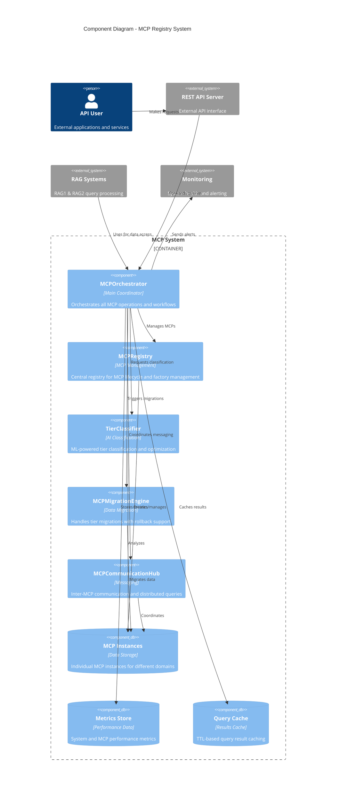
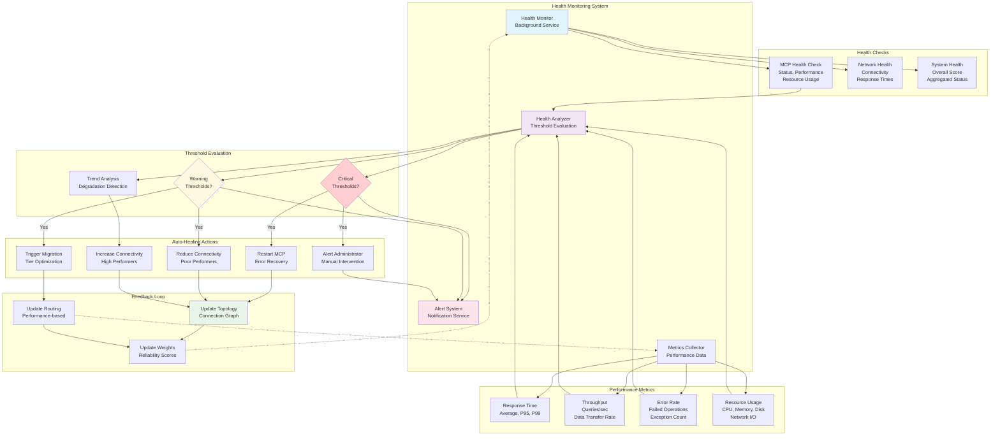
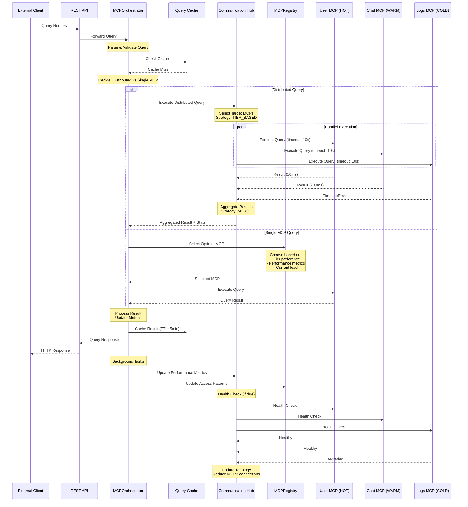

# MCP Component Interaction Diagrams

## 1. Component Interaction Overview

## 2. Data Flow Architecture

```mermaid
flowchart TB
    subgraph "Input Layer"
        API_REQ[API Requests]
        RAG_REQ[RAG Queries]
        ADMIN_REQ[Admin Operations]
    end

    subgraph "Orchestration Layer"
        ORCH[MCPOrchestrator<br/>Request Router]
        QUERY_CACHE[Query Cache<br/>5min TTL]
        ALERT_MGR[Alert Manager]
    end

    subgraph "Management Layer"
        REG[MCPRegistry<br/>MCP Factory & Lifecycle]
        CLASS[TierClassifier<br/>ML Classification]
        MIG[Migration Engine<br/>Data Movement]
        COMM[Communication Hub<br/>Distributed Queries]
    end

    subgraph "Data Layer"
        subgraph "HOT Tier - High Performance"
            HOT_USER[User MCP<br/>Vector Search]
            HOT_CHAT[Chat MCP<br/>Recent Messages]
            HOT_STATS[Stats MCP<br/>Real-time Analytics]
        end
        
        subgraph "WARM Tier - Balanced"
            WARM_USER[User MCP<br/>Profile Data]
            WARM_CHAT[Chat MCP<br/>Message History]
            WARM_LOGS[Logs MCP<br/>Recent Logs]
        end
        
        subgraph "COLD Tier - Archive"
            COLD_LOGS[Logs MCP<br/>Archive Logs]
            COLD_STATS[Stats MCP<br/>Historical Data]
            COLD_USER[User MCP<br/>Inactive Users]
        end
    end

    subgraph "Intelligence Layer"
        AI_PATTERNS[Pattern Learning]
        PERF_OPT[Performance Optimization]
        COST_OPT[Cost Optimization]
        PRED_CACHE[Predictive Caching]
    end

    %% Request flow
    API_REQ --> ORCH
    RAG_REQ --> ORCH
    ADMIN_REQ --> ORCH

    %% Cache check
    ORCH --> QUERY_CACHE
    QUERY_CACHE -->|Hit| ORCH
    QUERY_CACHE -->|Miss| REG

    %% Registry routing
    REG --> HOT_USER
    REG --> HOT_CHAT
    REG --> HOT_STATS
    REG --> WARM_USER
    REG --> WARM_CHAT
    REG --> WARM_LOGS
    REG --> COLD_LOGS
    REG --> COLD_STATS
    REG --> COLD_USER

    %% Classification feedback
    CLASS --> |analyze| HOT_USER
    CLASS --> |analyze| WARM_USER
    CLASS --> |analyze| COLD_USER
    CLASS --> |recommendations| MIG

    %% Migration flows
    MIG --> |promote| HOT_USER
    MIG --> |demote| COLD_USER
    MIG --> |optimize| WARM_USER

    %% Communication coordination
    COMM --> |distribute| HOT_USER
    COMM --> |distribute| WARM_CHAT
    COMM --> |distribute| COLD_LOGS

    %% Intelligence feedback
    AI_PATTERNS --> CLASS
    PERF_OPT --> MIG
    COST_OPT --> CLASS
    PRED_CACHE --> QUERY_CACHE

    %% Monitoring
    ORCH --> ALERT_MGR
    REG --> ALERT_MGR
    MIG --> ALERT_MGR

    %% Response flow
    HOT_USER -.-> |results| ORCH
    WARM_CHAT -.-> |results| ORCH
    COLD_LOGS -.-> |results| ORCH
    ORCH -.-> |cache| QUERY_CACHE

    style ORCH fill:#e1f5fe
    style REG fill:#f3e5f5
    style CLASS fill:#e8f5e8
    style MIG fill:#fff3e0
    style COMM fill:#fce4ec
    style HOT_USER fill:#ffebee
    style WARM_USER fill:#fff8e1
    style COLD_USER fill:#e0f2f1
```

## 3. Classification and Migration Pipeline

```mermaid
flowchart LR
    subgraph "Data Collection"
        MCP_META[MCP Metadata<br/>Size, Access Count<br/>Business Criticality]
        PERF_METRICS[Performance Metrics<br/>Query Time, Cache Hit<br/>Error Rate, Throughput]
        ACCESS_HIST[Access History<br/>24h Pattern, Trend<br/>Seasonality, Volatility]
    end

    subgraph "Pattern Analysis"
        EXTRACT[Extract Criteria<br/>Normalize Data]
        PATTERN[Analyze Access Pattern<br/>Frequency, Trend, Seasonality]
        FEATURES[Feature Engineering<br/>Access Weight, Perf Weight<br/>Business Weight]
    end

    subgraph "Multi-Algorithm Classification"
        RULE_ALG[Rule-Based Algorithm<br/>Threshold Evaluation<br/>Hard Limits]
        ML_ALG[ML-Based Algorithm<br/>Scoring System<br/>Pattern Recognition]
        COST_ALG[Cost Algorithm<br/>Storage vs Access Cost<br/>ROI Calculation]
        PERF_ALG[Performance Algorithm<br/>Query Speed Priority<br/>SLA Requirements]
    end

    subgraph "Ensemble & Decision"
        WEIGHTS[Calculate Weights<br/>Cost Sensitivity<br/>Performance Requirements]
        ENSEMBLE[Ensemble Results<br/>Weighted Average<br/>Confidence Scoring]
        DECISION[Final Decision<br/>Tier Recommendation<br/>Migration Priority]
    end

    subgraph "Migration Planning"
        VALIDATE[Validate Plan<br/>Dependencies<br/>Resource Availability]
        STRATEGY[Select Strategy<br/>Copy-Switch<br/>Streaming, Hybrid]
        SCHEDULE[Schedule Migration<br/>Priority Queue<br/>Resource Allocation]
    end

    subgraph "Migration Execution"
        PREPARE[Prepare<br/>Health Check<br/>Status Update]
        SNAPSHOT[Create Snapshot<br/>Rollback Point<br/>Data Integrity]
        TRANSFER[Data Transfer<br/>Batch Processing<br/>Progress Tracking]
        VALIDATE_MIG[Validate<br/>Checksum<br/>Performance Test]
        SWITCH[Switch Over<br/>Update Metadata<br/>Activate New Tier]
        CLEANUP[Cleanup<br/>Remove Old Data<br/>Update Indices]
    end

    %% Data flow
    MCP_META --> EXTRACT
    PERF_METRICS --> EXTRACT
    ACCESS_HIST --> PATTERN
    
    EXTRACT --> FEATURES
    PATTERN --> FEATURES
    
    FEATURES --> RULE_ALG
    FEATURES --> ML_ALG
    FEATURES --> COST_ALG
    FEATURES --> PERF_ALG
    
    RULE_ALG --> WEIGHTS
    ML_ALG --> WEIGHTS
    COST_ALG --> WEIGHTS
    PERF_ALG --> WEIGHTS
    
    WEIGHTS --> ENSEMBLE
    ENSEMBLE --> DECISION
    
    DECISION --> VALIDATE
    VALIDATE --> STRATEGY
    STRATEGY --> SCHEDULE
    
    SCHEDULE --> PREPARE
    PREPARE --> SNAPSHOT
    SNAPSHOT --> TRANSFER
    TRANSFER --> VALIDATE_MIG
    VALIDATE_MIG --> SWITCH
    SWITCH --> CLEANUP
    
    %% Error handling
    VALIDATE -.-> |invalid| DECISION
    TRANSFER -.-> |failed| SNAPSHOT
    VALIDATE_MIG -.-> |failed| SNAPSHOT
    SWITCH -.-> |failed| SNAPSHOT

    style EXTRACT fill:#e1f5fe
    style PATTERN fill:#f3e5f5
    style ENSEMBLE fill:#e8f5e8
    style DECISION fill:#fff3e0
    style TRANSFER fill:#fce4ec
    style VALIDATE_MIG fill:#f1f8e9
```

## 4. Inter-MCP Communication Patterns

```mermaid
graph TB
    subgraph "Communication Hub Architecture"
        HUB[MCPCommunicationHub<br/>Message Router]
        MSG_QUEUE[Message Queue<br/>Priority-based<br/>CRITICAL > HIGH > NORMAL > LOW]
        TOPOLOGY[Network Topology<br/>Node Connections<br/>Routing Table]
        PERF_CACHE[Performance Cache<br/>Response Times<br/>Reliability Scores]
    end

    subgraph "Message Types"
        QUERY_MSG[Query Messages<br/>query_request<br/>query_response]
        SYNC_MSG[Sync Messages<br/>data_sync<br/>cache_invalidation]
        HEALTH_MSG[Health Messages<br/>health_check<br/>performance_metrics]
        COORD_MSG[Coordination<br/>coordination<br/>migration_notification]
    end

    subgraph "Distribution Strategies"
        BROADCAST[Broadcast<br/>Send to All MCPs]
        ROUND_ROBIN[Round Robin<br/>Load Distribution]
        FASTEST_FIRST[Fastest First<br/>Performance-based]
        TIER_BASED[Tier-based<br/>HOT → WARM → COLD]
        CONTENT_AWARE[Content-aware<br/>Domain Routing]
    end

    subgraph "MCP Network"
        MCP_A[MCP A<br/>High Reliability<br/>Fast Response]
        MCP_B[MCP B<br/>Medium Reliability<br/>Average Response]
        MCP_C[MCP C<br/>Low Reliability<br/>Slow Response]
        MCP_D[MCP D<br/>High Reliability<br/>Fast Response]
    end

    subgraph "Aggregation Strategies"
        MERGE[Merge<br/>Combine All Results]
        FIRST_MATCH[First Match<br/>Return First Success]
        BEST_MATCH[Best Match<br/>Highest Quality]
        MAJORITY[Majority<br/>Consensus Results]
        UNION[Union<br/>Unique Combined]
        INTERSECTION[Intersection<br/>Common Results]
    end

    %% Hub connections
    HUB --> MSG_QUEUE
    HUB --> TOPOLOGY
    HUB --> PERF_CACHE

    %% Message processing
    MSG_QUEUE --> QUERY_MSG
    MSG_QUEUE --> SYNC_MSG
    MSG_QUEUE --> HEALTH_MSG
    MSG_QUEUE --> COORD_MSG

    %% Strategy selection
    HUB --> BROADCAST
    HUB --> ROUND_ROBIN
    HUB --> FASTEST_FIRST
    HUB --> TIER_BASED
    HUB --> CONTENT_AWARE

    %% Network connections
    TOPOLOGY --> MCP_A
    TOPOLOGY --> MCP_B
    TOPOLOGY --> MCP_C
    TOPOLOGY --> MCP_D

    %% High-performance connections (thick lines)
    MCP_A -.-> |high connectivity| MCP_D
    MCP_A -.-> |high connectivity| MCP_B
    
    %% Reduced connections for poor performers
    MCP_C -.-> |limited connectivity| MCP_B

    %% Aggregation
    MCP_A --> MERGE
    MCP_B --> FIRST_MATCH
    MCP_C --> BEST_MATCH
    MCP_D --> MAJORITY

    %% Performance feedback
    PERF_CACHE -.-> |update metrics| MCP_A
    PERF_CACHE -.-> |update metrics| MCP_B
    PERF_CACHE -.-> |update metrics| MCP_C
    PERF_CACHE -.-> |update metrics| MCP_D

    style HUB fill:#e1f5fe
    style MSG_QUEUE fill:#f3e5f5
    style TOPOLOGY fill:#e8f5e8
    style MCP_A fill:#c8e6c9
    style MCP_B fill:#fff8e1
    style MCP_C fill:#ffcdd2
    style MCP_D fill:#c8e6c9
```

## 5. Health Monitoring and Auto-Healing

## 6. Query Execution Pipeline

## Key Integration Points

### 1. Factory Pattern Integration
- **MCPRegistry** uses factory pattern for dynamic MCP creation
- **Type-based factories** registered for each MCPType
- **Configuration-driven** MCP instantiation with domain specialization

### 2. Event-Driven Coordination
- **EventEmitter-based** communication across all components
- **Loose coupling** through event subscription patterns
- **Cross-component workflows** triggered by event chains

### 3. Performance Optimization
- **Query result caching** with TTL-based invalidation
- **Performance-based routing** using collected metrics
- **Adaptive topology optimization** based on health scores

### 4. Fault Tolerance
- **Circuit breaker pattern** for unhealthy MCPs
- **Graceful degradation** with partial results
- **Auto-healing mechanisms** for performance issues

### 5. Scalability Features
- **Horizontal scaling** through MCP multiplication
- **Load balancing** via communication hub
- **Resource optimization** through tier classification

This architecture provides a robust, scalable, and intelligent MCP management system with comprehensive monitoring, auto-healing, and optimization capabilities.