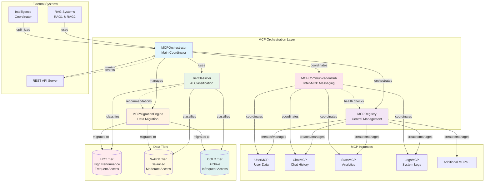
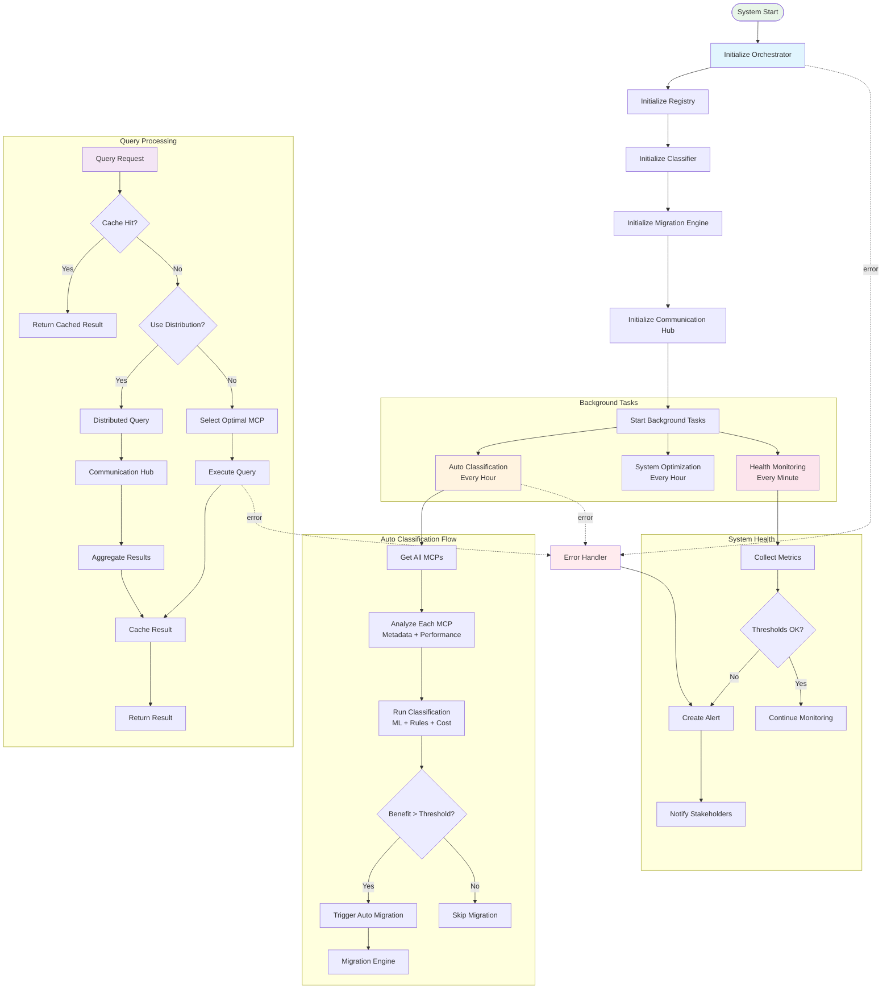
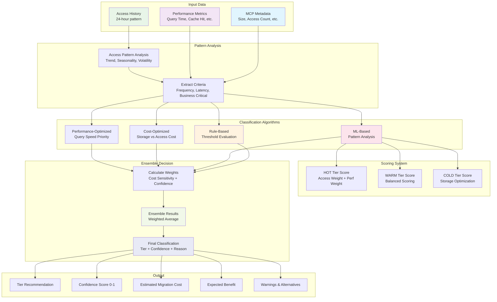
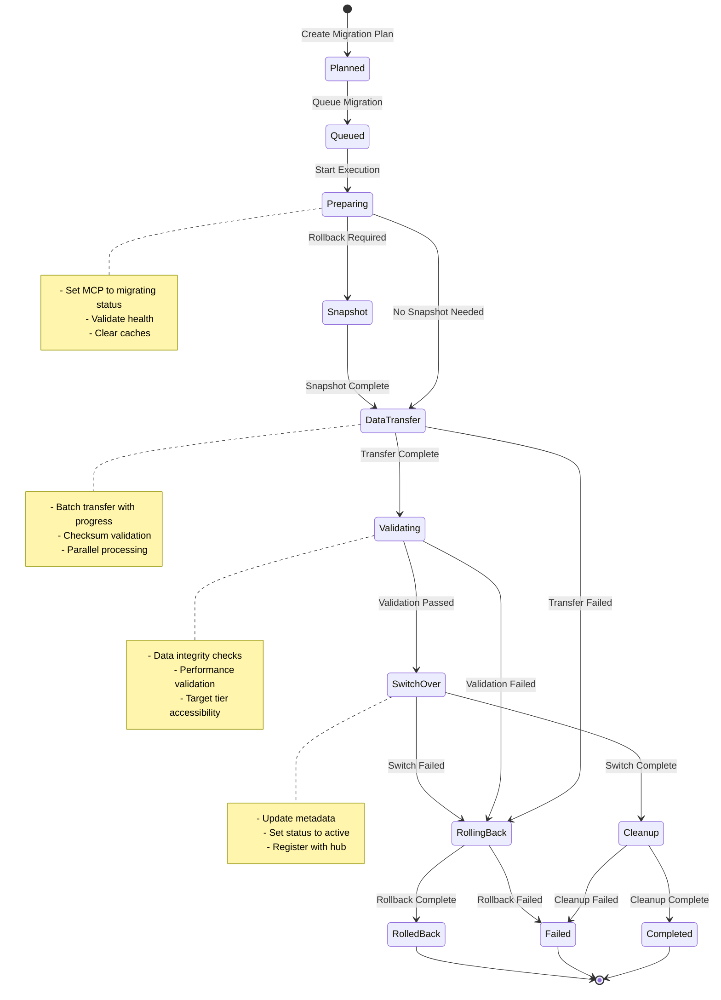
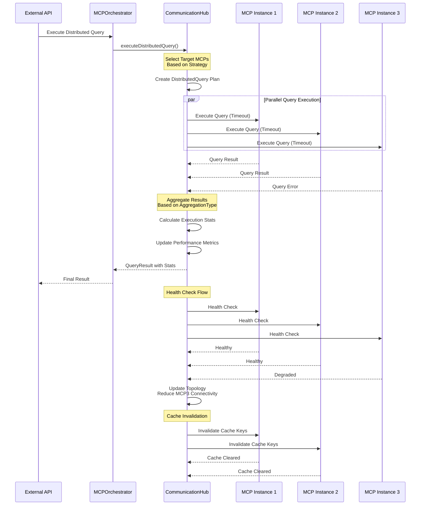
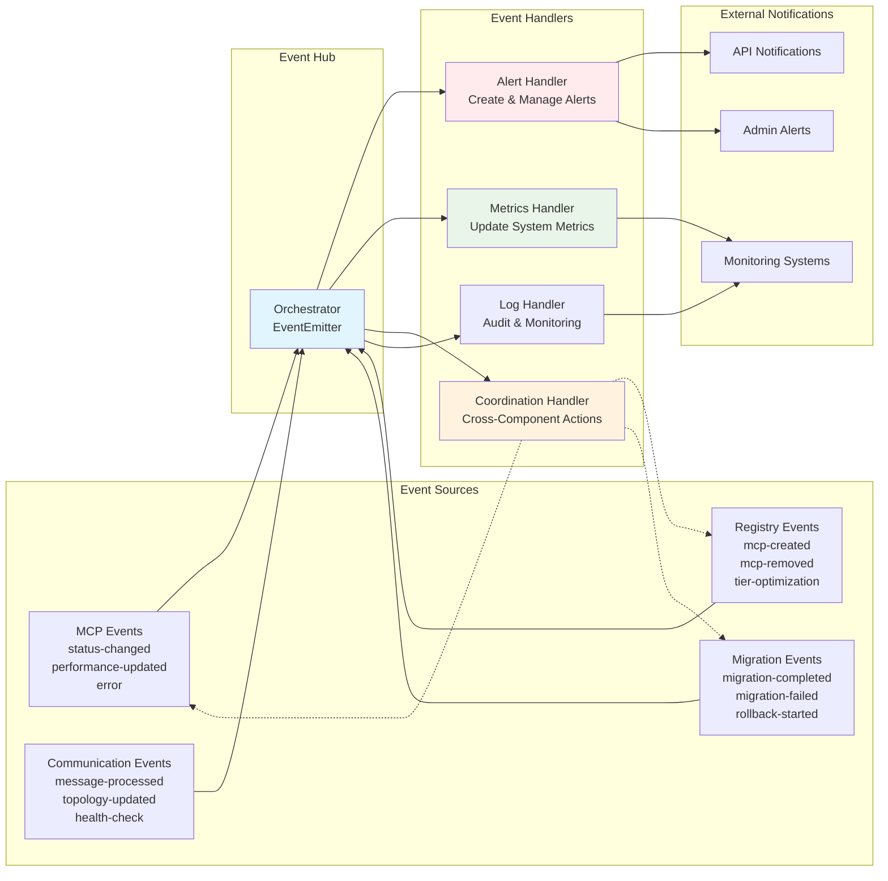

# MCP Registry Architecture Diagrams

## 1. Overall MCP System Architecture

## 2. MCPRegistry Component Architecture

```mermaid
graph TB
%% ─────────── MCPRegistry Core ───────────
    subgraph MCPRegistry_Core ["MCPRegistry Core"]
        REG["MCPRegistry<br/>EventEmitter"]
        FACTORIES["MCP Factories<br/>Map&lt;MCPType, Factory&gt;"]
        MCPS["Active MCPs<br/>Map&lt;string, BaseMCP&gt;"]
        CONFIG["Registry Config<br/>maxMCPs, autoScaling, etc."]
    end

%% ─────────── Background Tasks ───────────
    subgraph Background_Tasks ["Background Tasks"]
        CLEANUP["Cleanup Timer<br/>Cache &amp; Storage Optimization"]
        PERF_MON["Performance Monitor<br/>Tier Optimization"]
        HEALTH["Health Checker<br/>MCP Status Monitoring"]
    end

%% ─────────── MCP Lifecycle Management ───────────
    subgraph MCP_Lifecycle_Management ["MCP Lifecycle Management"]
        CREATE["createMCP()<br/>Factory Pattern"]
        REGISTER["registerMCP()<br/>Legacy Support"]
        REMOVE["removeMCP()<br/>With Backup"]
        QUERY["Query Operations<br/>By Type/Tier/Tag/Domain"]
    end

%% ─────────── Tier Management ───────────
    subgraph Tier_Management ["Tier Management"]
        OPTIMIZE["optimizeAllTiers()<br/>Auto Promotion/Demotion"]
        PROMOTE["promoteMCPToHot()"]
        DEMOTE["demoteMCPToCold()"]
        THRESHOLDS["Performance Thresholds<br/>Access &amp; Latency"]
    end

%% ─────────── Monitoring & Stats ───────────
    subgraph Monitoring_Stats ["Monitoring &amp; Stats"]
        STATS["getRegistryStats()<br/>Performance Metrics"]
        HEALTH_CHECK["performHealthCheck()"]
        METRICS["getSystemMetrics()"]
        LOGS["getLogs()"]
    end

%% ─────────── Backup & Recovery ───────────
    subgraph Backup_Recovery ["Backup &amp; Recovery"]
        BACKUP_MCP["backupMCP()"]
        BACKUP_ALL["backupAll()"]
        MAINTENANCE["startMaintenance()"]
        RESTORE["Restore Operations"]
    end

%% ── Core connections
    REG --> FACTORIES
    REG --> MCPS
    REG --> CONFIG

%% ── Lifecycle management
    CREATE --> FACTORIES
    CREATE --> MCPS
    REGISTER --> CREATE
    REMOVE --> MCPS

%% ── Background tasks
    REG --> CLEANUP
    REG --> PERF_MON
    REG --> HEALTH

%% ── Tier management
    OPTIMIZE --> PROMOTE
    OPTIMIZE --> DEMOTE
    OPTIMIZE --> THRESHOLDS

%% ── Operations
    STATS --> MCPS
    HEALTH_CHECK --> MCPS
    METRICS --> MCPS

%% ── Backup operations
    BACKUP_ALL --> BACKUP_MCP
    MAINTENANCE --> BACKUP_MCP

%% ── Event flows (dashed)
    REG -. events .-> CREATE
    REG -. events .-> REMOVE
    REG -. events .-> OPTIMIZE
    REG -. events .-> BACKUP_ALL

%% ── Styling
    style REG          fill:#e1f5fe
    style FACTORIES    fill:#f3e5f5
    style MCPS         fill:#e8f5e8
    style CREATE       fill:#fff3e0
    style OPTIMIZE     fill:#fce4ec
    style STATS        fill:#f1f8e9

```

## 3. MCPOrchestrator Workflow

## 4. TierClassifier Decision Engine

## 5. Migration Engine State Machine

## 6. Communication Hub Message Flow

## 7. Event-Driven Architecture Flow

## Key Architecture Principles

1. **Event-Driven Design**: All components use EventEmitter for loose coupling
2. **Factory Pattern**: MCPRegistry uses factories for dynamic MCP creation
3. **Strategy Pattern**: Multiple algorithms for classification, migration, and query distribution
4. **Observer Pattern**: Health monitoring and metrics collection
5. **State Machine**: Migration engine with well-defined state transitions
6. **Pub-Sub**: Communication hub for inter-MCP messaging
7. **CQRS**: Separate query and command handling paths
8. **Circuit Breaker**: Health checks with automatic failover
9. **Batching**: Background tasks for optimization and cleanup
10. **Caching**: Query result caching with TTL and size limits