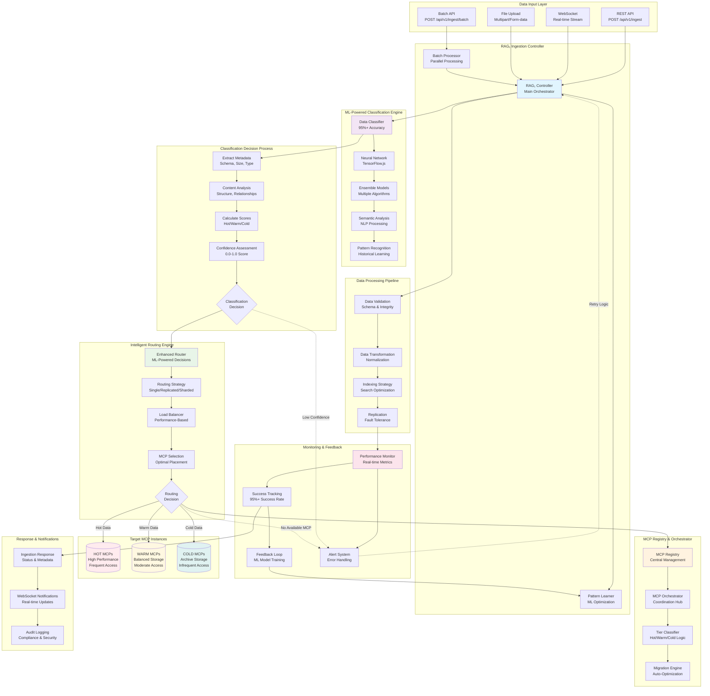
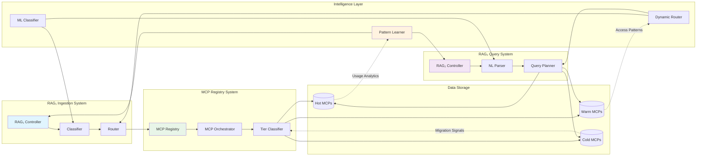
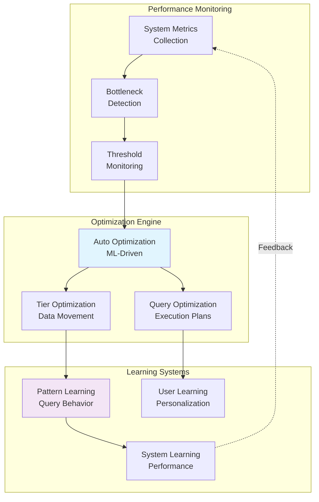

# RAG System Flow Diagrams
## Complete RAG₁ Ingestion and RAG₂ Query Processing Flows

This document contains comprehensive Mermaid flow diagrams mapping the complete data ingestion and query processing flows for the Enterprise Multi-MCP Smart Database system.

---

## 1. RAG₁ Complete Ingestion Flow

---

## 2. RAG₂ Complete Query Processing Flow

```mermaid
graph TB
%% ─────────── Query Input Layer ───────────
    subgraph Query_Input_Layer
        NL_QUERY["Natural Language Query<br/>“Get all users active today”"]
        REST_API["REST API<br/>POST /api/v1/query"]
        WS_QUERY["WebSocket Query<br/>Real‑time Subscription"]
        BATCH_QUERY["Batch Queries<br/>Multiple Queries"]
    end

%% ─────────── RAG₂ Controller ───────────
    subgraph RAG2_Query_Controller
        RAG2_CTRL["RAG₂ Controller<br/>“Eliminates SQL Forever”"]
        QUERY_ROUTER["Query Router<br/>Intelligent Distribution"]
        CACHE_CHECK{{Cache Check<br/>Result Caching}}
    end

%% ─────────── Natural Language Parser ───────────
    subgraph Natural_Language_Parser
        NL_PARSER["NL Parser<br/>Advanced NLP"]
        ML_CLASSIFIER["ML Classifier<br/>Intent Classification"]
        NER_SYSTEM["Named Entity Recognition<br/>Entity Extraction"]
        CONTEXT_ANALYZER["Context Analyzer<br/>Conversation History"]
    end

%% ─────────── Intent Classification Engine ───────────
    subgraph Intent_Classification_Engine
        INTENT_EXTRACT["Intent Extraction<br/>RETRIEVE / SEARCH / COUNT"]
        CONFIDENCE_CALC["Confidence Calc<br/>0.0 – 1.0"]
        MULTI_INTENT{{Multiple Intents?<br/>Complex Query}}
        INTENT_RANKING["Intent Ranking<br/>Priority"]
    end

%% ─────────── Entity & Context Processing ───────────
    subgraph Entity_Context_Processing
        ENTITY_EXTRACT["Entity Extraction<br/>Users, Dates, IDs"]
        FILTER_BUILD["Filter Builder<br/>Query Conditions"]
        JOIN_DETECT["Join Detection<br/>Cross‑MCP"]
        TEMPORAL_PROC["Temporal Processing<br/>Time‑based"]
    end

%% ─────────── Query Planning Engine ───────────
    subgraph Query_Planning_Engine
        QUERY_PLANNER["Query Planner<br/>Execution Strategy"]
        MCP_SELECTION["MCP Selection<br/>Optimal Targets"]
        PARALLEL_PLAN["Parallel Planning<br/>Concurrent"]
        COST_OPTIMIZER["Cost Optimizer<br/>Perf vs Accuracy"]
    end

%% ─────────── Execution Strategy Decision ───────────
    subgraph Execution_Strategy_Decision
        EXEC_STRATEGY{{Execution Strategy}}
        SINGLE_MCP["Single MCP<br/>Direct"]
        DISTRIBUTED["Distributed<br/>Multiple MCPs"]
        FEDERATED["Federated<br/>Cross‑MCP Joins"]
    end

%% ─────────── MCP Query Execution ───────────
    subgraph MCP_Query_Execution
        HOT_QUERY(["HOT MCP Query<br/>Real‑time"])
        WARM_QUERY(["WARM MCP Query<br/>Recent"])
        COLD_QUERY(["COLD MCP Query<br/>Archive"])
        TIMEOUT_MGR["Timeout Manager<br/>Limits"]
    end

%% ─────────── Result Aggregation Engine ───────────
    subgraph Result_Aggregation_Engine
        RESULT_AGG["Result Aggregator"]
        MERGE_STRATEGY["Merge Strategy<br/>Union / Intersect"]
        DEDUPE["Deduplication"]
        SORT_RANK["Sorting &amp; Ranking"]
    end

%% ─────────── Intelligence & Learning ───────────
    subgraph Intelligence_Layer
        PATTERN_LEARNER["Pattern Learner"]
        DYNAMIC_ROUTER["Dynamic Router<br/>Perf‑Based"]
        ML_INSIGHTS["ML Insights"]
        USER_BEHAVIOR["User Behavior"]
    end

%% ─────────── Response Processing ───────────
    subgraph Response_Processing
        RESPONSE_FORMAT["Response Formatter<br/>JSON / XML / CSV"]
        METADATA_ADD["Metadata Addition"]
        EXPLAIN_GEN["Explanation Generator"]
        CACHE_STORE["Cache Storage"]
    end

%% ─────────── Real‑time Features ───────────
    subgraph Real_time_Features
        WS_STREAM["WebSocket Streaming"]
        SUBSCRIPTION_MGR["Subscription Manager"]
        NOTIFICATION_SYS["Notification System"]
    end

%% ─── Query Input Flow
    NL_QUERY --> RAG2_CTRL
    REST_API --> RAG2_CTRL
    WS_QUERY --> SUBSCRIPTION_MGR
    BATCH_QUERY --> RAG2_CTRL

    RAG2_CTRL --> QUERY_ROUTER
    QUERY_ROUTER --> CACHE_CHECK
    CACHE_CHECK -->|Cache Miss| NL_PARSER
    CACHE_CHECK -->|Cache Hit| RESPONSE_FORMAT

%% ─── NLP Pipeline
    NL_PARSER --> ML_CLASSIFIER
    ML_CLASSIFIER --> NER_SYSTEM
    NER_SYSTEM --> CONTEXT_ANALYZER

%% ─── Intent Processing
    CONTEXT_ANALYZER --> INTENT_EXTRACT
    INTENT_EXTRACT --> CONFIDENCE_CALC
    CONFIDENCE_CALC --> MULTI_INTENT
    MULTI_INTENT -->|Yes| INTENT_RANKING
    MULTI_INTENT -->|No| ENTITY_EXTRACT
    INTENT_RANKING --> ENTITY_EXTRACT

%% ─── Entity & Context
    ENTITY_EXTRACT --> FILTER_BUILD
    FILTER_BUILD --> JOIN_DETECT
    JOIN_DETECT --> TEMPORAL_PROC

%% ─── Query Planning
    TEMPORAL_PROC --> QUERY_PLANNER
    QUERY_PLANNER --> MCP_SELECTION
    MCP_SELECTION --> PARALLEL_PLAN
    PARALLEL_PLAN --> COST_OPTIMIZER

%% ─── Execution Strategy
    COST_OPTIMIZER --> EXEC_STRATEGY
    EXEC_STRATEGY -->|Simple| SINGLE_MCP
    EXEC_STRATEGY -->|Complex| DISTRIBUTED
    EXEC_STRATEGY -->|Cross‑MCP| FEDERATED

%% ─── MCP Execution
    SINGLE_MCP --> HOT_QUERY
    DISTRIBUTED --> HOT_QUERY
    DISTRIBUTED --> WARM_QUERY
    FEDERATED --> COLD_QUERY

    HOT_QUERY --> TIMEOUT_MGR
    WARM_QUERY --> TIMEOUT_MGR
    COLD_QUERY --> TIMEOUT_MGR

%% ─── Result Processing
    TIMEOUT_MGR --> RESULT_AGG
    RESULT_AGG --> MERGE_STRATEGY
    MERGE_STRATEGY --> DEDUPE
    DEDUPE --> SORT_RANK
    SORT_RANK --> RESPONSE_FORMAT

%% ─── Intelligence & Learning
    SORT_RANK --> PATTERN_LEARNER
    PATTERN_LEARNER --> DYNAMIC_ROUTER
    DYNAMIC_ROUTER --> ML_INSIGHTS
    ML_INSIGHTS --> USER_BEHAVIOR

%% ─── Response Generation
    RESPONSE_FORMAT --> METADATA_ADD
    METADATA_ADD --> EXPLAIN_GEN
    EXPLAIN_GEN --> CACHE_STORE
    CACHE_STORE --> WS_STREAM

%% ─── Real‑time Features
    SUBSCRIPTION_MGR --> WS_STREAM
    WS_STREAM --> NOTIFICATION_SYS

%% ─── Learning Feedback (dashed)
    USER_BEHAVIOR -. Learning .-> ML_CLASSIFIER
    PATTERN_LEARNER -. Optimization .-> QUERY_PLANNER

%% ─── Error / Timeout (dashed)
    TIMEOUT_MGR -. Timeout .-> RESULT_AGG
    EXEC_STRATEGY -. Failure .-> QUERY_ROUTER

%% ─── Styling
    style RAG2_CTRL         fill:#e1f5fe
    style NL_PARSER         fill:#f3e5f5
    style QUERY_PLANNER     fill:#e8f5e8
    style RESULT_AGG        fill:#fff3e0
    style PATTERN_LEARNER   fill:#fce4ec
    style HOT_QUERY         fill:#ffebee
    style WARM_QUERY        fill:#fff8e1
    style COLD_QUERY        fill:#e0f2f1

```

---

## 3. Integration Points & Data Flow

---

## 4. Performance & Optimization Flows

---

## Key Integration Features

### RAG₁ Ingestion Highlights:
- **95%+ Classification Accuracy** using ensemble ML models
- **Real-time Pattern Learning** from ingestion patterns
- **Intelligent Routing** with performance-based MCP selection
- **Auto-Migration** between Hot/Warm/Cold tiers
- **Batch Processing** with parallel execution strategies

### RAG₂ Query Highlights:
- **"Eliminates SQL Forever"** with natural language processing
- **Multi-Intent Recognition** for complex queries
- **Cross-MCP Federation** for distributed queries
- **Real-time Subscriptions** via WebSocket streaming
- **Pattern-Based Optimization** for query performance

### Intelligence Layer Integration:
- **Pattern Learner** optimizes both ingestion and query flows
- **ML Classifier** provides consistent classification across systems
- **Dynamic Router** adapts to real-time performance metrics
- **Feedback Loops** continuously improve system performance

### Enterprise Features:
- **Security & Compliance** with audit logging throughout
- **Performance Monitoring** with real-time metrics
- **Auto-Scaling** based on load and performance
- **Fault Tolerance** with replication and failover
- **WebSocket Integration** for real-time features

This comprehensive flow analysis demonstrates how RAG₁ and RAG₂ work together to provide a complete "SQL-free" database experience with intelligent data management and natural language query processing.