# 🛡️ Security Architecture Documentation
## Enterprise Multi-MCP Smart Database System

### 🏗️ Security Architecture Overview

The system implements a comprehensive **5-layer security architecture** with defense-in-depth principles:

```mermaid
graph TB
    Client[Client Applications] --> PresentationLayer[🌐 Presentation Layer]
    PresentationLayer --> AuthenticationLayer[🔐 Authentication Layer]
    AuthenticationLayer --> AuthorizationLayer[🔑 Authorization Layer]
    AuthorizationLayer --> SecurityLayer[🛡️ Security Layer]
    SecurityLayer --> LoggingLayer[📊 Logging & Monitoring Layer]
    LoggingLayer --> DataLayer[(💾 Data Layer)]

    subgraph PresentationLayer["🌐 Presentation Layer"]
        CORS[CORS Middleware]
        Validation[Input Validation]
        ContentType[Content-Type Validation]
        SizeLimit[Request Size Limits]
        APIVersion[API Versioning]
    end

    subgraph AuthenticationLayer["🔐 Authentication Layer"]
        JWT[JWT Token Verification]
        Bearer[Bearer Token Extraction]
        SessionMgmt[Session Management]
        TokenExp[Token Expiration]
    end

    subgraph AuthorizationLayer["🔑 Authorization Layer"]
        RBAC[Role-Based Access Control]
        PermissionCheck[Permission Verification]
        AdminPriv[Admin Privileges]
        ResourceAuth[Resource-Level Auth]
    end

    subgraph SecurityLayer["🛡️ Security Layer"]
        RateLimit[Rate Limiting]
        IPBlocking[IP Blocking]
        ThreatDetect[Threat Detection]
        Encryption[Data Encryption]
        AuditLog[Audit Logging]
    end

    subgraph LoggingLayer["📊 Logging & Monitoring Layer"]
        RequestLog[Request Logging]
        SecurityLog[Security Event Logging]
        Performance[Performance Metrics]
        Sanitization[Data Sanitization]
    end
```



---

## 🔐 Authentication & Authorization Flow

### Authentication Process


### Authorization Process

```mermaid
graph LR
    Request[API Request] --> AuthCheck{Authenticated?}
    AuthCheck -->|No| Deny401[❌ 401 Unauthorized]
    AuthCheck -->|Yes| RoleCheck{Role Check}
    
    RoleCheck -->|Admin| AdminAccess[✅ Full Access]
    RoleCheck -->|User| PermCheck{Permission Check}
    RoleCheck -->|Readonly| ReadOnlyCheck{Read Permission?}
    
    PermCheck -->|Has Permission| Allow[✅ Allow Access]
    PermCheck -->|No Permission| Deny403[❌ 403 Forbidden]
    
    ReadOnlyCheck -->|Read Operation| Allow
    ReadOnlyCheck -->|Write Operation| Deny403
```


---

## 🛡️ Data Protection Mechanisms

### 🔒 Encryption at Rest
- **Algorithm**: AES-256-GCM (Authenticated Encryption)
- **Key Derivation**: Scrypt with salt
- **Key Management**: Derived from JWT secret
- **IV Generation**: Cryptographically secure random bytes

```typescript
// Encryption Implementation
encrypt(data: string): { encrypted: string; iv: string; tag: string } {
  const iv = crypto.randomBytes(16);
  const cipher = crypto.createCipheriv('aes-256-gcm', this.encryptionKey, iv);
  
  let encrypted = cipher.update(data, 'utf8', 'hex');
  encrypted += cipher.final('hex');
  
  const tag = cipher.getAuthTag();
  
  return {
    encrypted,
    iv: iv.toString('hex'),
    tag: tag.toString('hex')
  };
}
```

### 🚀 Encryption in Transit
- **Protocol**: HTTPS/TLS 1.3
- **JWT Signing**: HS256 algorithm
- **Headers**: Secure headers (X-Request-ID, CORS)
- **Token Transport**: Bearer token in Authorization header

### 🔑 Password Security
- **Algorithm**: bcrypt with 12 salt rounds
- **Storage**: Never store plaintext passwords
- **Validation**: Secure comparison with bcrypt.compare()

---

## 🚨 Security Controls & Monitoring

### Rate Limiting Strategy

```mermaid
graph TB
    subgraph RateLimits["Rate Limiting Tiers"]
        Auth[Authentication Endpoints<br/>10 requests / 15 minutes]
        Sensitive[Sensitive Operations<br/>3 requests / 1 hour]
        Validation[Validation Endpoints<br/>200 requests / 5 minutes]
        Global[Global Rate Limit<br/>100 requests / 15 minutes]
    end

    Auth --> IPBlock{IP Blocking}
    Sensitive --> IPBlock
    Validation --> IPBlock
    Global --> IPBlock

    IPBlock -->|5+ Violations| PermanentBlock[🚫 Permanent IP Block]
    IPBlock -->|<5 Violations| TempBlock[⏰ Temporary Monitoring]
```


### 🔍 Threat Detection Patterns

#### SQL Injection Detection
- `union select`, `drop table`, `insert into`, `delete from`
- `update set`, `create table`, `alter table`, `exec(`

#### XSS Attack Detection  
- `<script`, `javascript:`, `onerror=`, `onload=`, `onclick=`

#### Path Traversal Detection
- `../`, `..\\`, `%2e%2e%2f`, `%2e%2e%5c`

#### Suspicious User Agents
- `sqlmap`, `nikto`, `nmap`, `masscan`, `burpsuite`

### 📊 Audit Logging Architecture

```mermaid
graph LR
    subgraph Events["Security Events"]
        AuthSuccess[✅ Authentication Success]
        AuthFail[❌ Authentication Failure]
        AuthzFail[❌ Authorization Failure]
        RateLimit[⚠️ Rate Limit Exceeded]
        SuspActivity[🚨 Suspicious Activity]
        IPBlock[🚫 IP Blocking]
    end

    Events --> AuditLog[(📋 Audit Log)]
    Events --> SecurityAlert[(🚨 Security Alerts)]
    
    AuditLog --> LogFields[Log Fields:<br/>• User ID<br/>• IP Address<br/>• Timestamp<br/>• Action<br/>• Resource<br/>• Success/Failure<br/>• Risk Level]
    
    SecurityAlert --> AlertFields[Alert Fields:<br/>• Alert Type<br/>• Severity Level<br/>• Source IP<br/>• Description<br/>• Action Taken<br/>• Metadata]
```


---

## 🏛️ Security Middleware Stack

### Request Processing Pipeline

```mermaid
graph TD
    Incoming[📨 Incoming Request] --> RequestID[🏷️ Request ID Middleware]
    RequestID --> CORS[🌐 CORS Middleware]
    CORS --> RateLimit[⏰ Rate Limiting]
    RateLimit --> Sanitize[🧹 Input Sanitization]
    Sanitize --> Validate[✅ Input Validation]
    Validate --> ContentType[📋 Content-Type Check]
    ContentType --> SizeCheck[📏 Size Validation]
    SizeCheck --> Auth[🔐 Authentication]
    Auth --> Authz[🔑 Authorization]
    Authz --> IPCheck[🛡️ IP Blocking Check]
    IPCheck --> ThreatDetect[🔍 Threat Detection]
    ThreatDetect --> Handler[🎯 Route Handler]
    Handler --> Response[📤 Response]
    Response --> AuditLog[📊 Audit Logging]

    style Auth fill:#e1f5fe
    style Authz fill:#f3e5f5
    style ThreatDetect fill:#ffebee
    style AuditLog fill:#e8f5e8
```


### 🔧 Middleware Components Detail

| Layer | Component | Location | Function |
|-------|-----------|----------|----------|
| **Presentation** | CORS | `validation.ts` | Cross-origin request handling |
| **Presentation** | Input Validation | `validation.ts` | Zod schema validation |
| **Presentation** | Sanitization | `validation.ts` | XSS/injection prevention |
| **Authentication** | JWT Verification | `auth.ts` | Token validation |
| **Authentication** | User Loading | `auth.ts` | Database user lookup |
| **Authorization** | Role Check | `auth.ts` | RBAC implementation |
| **Authorization** | Permission Check | `auth.ts` | Granular permissions |
| **Security** | Rate Limiting | `SecurityManager.ts` | Request throttling |
| **Security** | IP Blocking | `SecurityManager.ts` | Malicious IP prevention |
| **Security** | Threat Detection | `SecurityManager.ts` | Attack pattern recognition |
| **Logging** | Request Logging | `requestLogger.ts` | HTTP request/response logging |
| **Logging** | Security Logging | `SecurityManager.ts` | Security event logging |

---

## 🎯 Role-Based Access Control (RBAC)

### Role Hierarchy

```mermaid
graph TB
%% ─────── Roles ───────
    subgraph "Roles"
        ADMIN["👑 Admin Role<br/>Permissions: ['*']"]
        USER["👤 User Role<br/>Permissions: ['query:read', 'ingest:write']"]
        READONLY["👁️ Readonly Role<br/>Permissions: ['query:read']"]
    end

%% ─────── Operations ───────
    subgraph "Operations"
        USER_OPS["All User Operations"]
        SYS_ADMIN["System Administration"]
        SEC_MGMT["Security Management"]

        QUERY_READ["Query Data"]
        INGEST_WRITE["Ingest Data"]
    end

%% Role → Operation edges
    ADMIN --> USER_OPS
    ADMIN --> SYS_ADMIN
    ADMIN --> SEC_MGMT

    USER  --> QUERY_READ
    USER  --> INGEST_WRITE

    READONLY --> QUERY_READ

%% Internal breakdown of USER_OPS
    USER_OPS --> QUERY_READ
    USER_OPS --> INGEST_WRITE

```


### Permission Matrix

| Operation | Admin | User | Readonly |
|-----------|-------|------|----------|
| **Query Data** | ✅ | ✅ | ✅ |
| **Ingest Data** | ✅ | ✅ | ❌ |
| **User Management** | ✅ | ❌ | ❌ |
| **System Config** | ✅ | ❌ | ❌ |
| **Security Logs** | ✅ | ❌ | ❌ |
| **MCP Management** | ✅ | ❌ | ❌ |

---

## 🔄 Session Management

### JWT Token Lifecycle

```mermaid
stateDiagram-v2
    [*] --> TokenGenerated: User Login
    TokenGenerated --> TokenActive: Token Issued
    TokenActive --> TokenRefresh: Near Expiration
    TokenRefresh --> TokenActive: New Token Issued
    TokenActive --> TokenExpired: Time Limit Reached
    TokenExpired --> [*]: User Logout
    TokenActive --> TokenRevoked: Manual Logout
    TokenRevoked --> [*]: Session Ended

    note right of TokenGenerated
        • HS256 Algorithm
        • 15min default expiry
        • 7d refresh token
    end note

    note right of TokenActive
        • Validated on each request
        • User data attached
        • Permissions checked
    end note
```


### Session Security Features
- **Token Expiration**: 15 minutes default (configurable)
- **Refresh Tokens**: 7 days for "Remember Me"
- **Token Validation**: On every protected route
- **Session Timeout**: Configurable inactivity timeout
- **Logout**: Token invalidation (TODO: implement blacklisting)

---

## 📈 Security Metrics & Monitoring

### Key Security Metrics


### Performance Impact
| Security Component | Avg Latency | CPU Impact | Memory Impact |
|-------------------|-------------|------------|---------------|
| **JWT Verification** | <5ms | Low | Minimal |
| **bcrypt Hashing** | 50-100ms | Medium | Low |
| **Input Validation** | <2ms | Low | Minimal |
| **Rate Limiting** | <1ms | Very Low | Low |
| **Audit Logging** | <3ms | Low | Low |
| **Encryption/Decryption** | <10ms | Medium | Minimal |

---

## 🚀 Security Best Practices Implemented

### ✅ Authentication Security
- [x] Strong password hashing (bcrypt, 12 rounds)
- [x] Secure JWT implementation (HS256)
- [x] Token expiration and refresh
- [x] Rate limiting on auth endpoints
- [x] Account lockout prevention
- [x] Secure session management

### ✅ Authorization Security  
- [x] Principle of least privilege
- [x] Role-based access control
- [x] Granular permissions
- [x] Resource-level authorization
- [x] Admin privilege separation

### ✅ Data Protection
- [x] AES-256-GCM encryption at rest
- [x] TLS encryption in transit
- [x] Secure key management
- [x] Data sanitization in logs
- [x] Input validation and sanitization

### ✅ Attack Prevention
- [x] SQL injection prevention
- [x] XSS attack mitigation
- [x] CSRF protection via JWT
- [x] Path traversal prevention
- [x] DoS attack mitigation
- [x] IP-based blocking

### ✅ Monitoring & Logging
- [x] Comprehensive audit logging
- [x] Security event monitoring
- [x] Performance metrics tracking
- [x] Real-time threat detection
- [x] Automated alerting

---

## 🔍 Security Testing Recommendations

### Penetration Testing Checklist
- [ ] **Authentication Bypass**: Test JWT manipulation, token replay
- [ ] **Authorization Flaws**: Test privilege escalation, horizontal access
- [ ] **Input Validation**: Test injection attacks, malformed data  
- [ ] **Session Management**: Test token hijacking, fixation
- [ ] **Rate Limiting**: Test bypass techniques, distributed attacks
- [ ] **Encryption**: Test key exposure, weak algorithms

### Automated Security Scanning Tools
- **SAST**: Static Application Security Testing
- **DAST**: Dynamic Application Security Testing  
- **Dependency Scanning**: npm audit, Snyk
- **Container Scanning**: Docker image vulnerability scanning

---

## 🚨 Incident Response Plan

### Security Incident Classification
1. **Critical**: Data breach, system compromise
2. **High**: Authentication bypass, privilege escalation
3. **Medium**: DoS attacks, suspicious activity
4. **Low**: Failed login attempts, minor violations

### Response Procedures
1. **Detection**: Automated monitoring alerts
2. **Assessment**: Security team investigation
3. **Containment**: IP blocking, account suspension
4. **Recovery**: System restoration, patch deployment
5. **Lessons Learned**: Post-incident analysis

---

## 📚 Security Architecture Summary

The Enterprise Multi-MCP Smart Database System implements a **comprehensive 5-layer security architecture** with:

🔐 **Strong Authentication**: JWT tokens with bcrypt password hashing  
🔑 **Fine-grained Authorization**: RBAC with granular permissions  
🛡️ **Advanced Threat Protection**: Real-time attack detection and prevention  
🔒 **Data Encryption**: AES-256-GCM at rest, TLS in transit  
📊 **Complete Monitoring**: Audit logging with security metrics  
⚡ **Performance Optimized**: Minimal latency impact (<10ms avg)  

This architecture provides **enterprise-grade security** while maintaining high performance and usability for the smart database system.