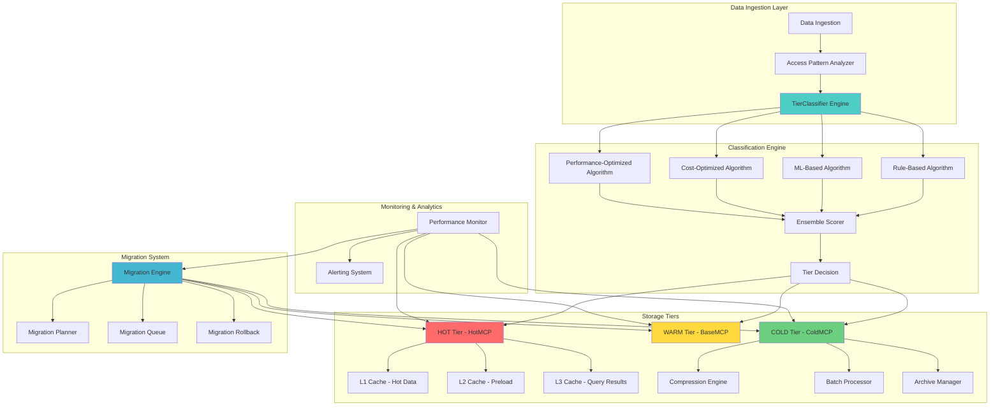
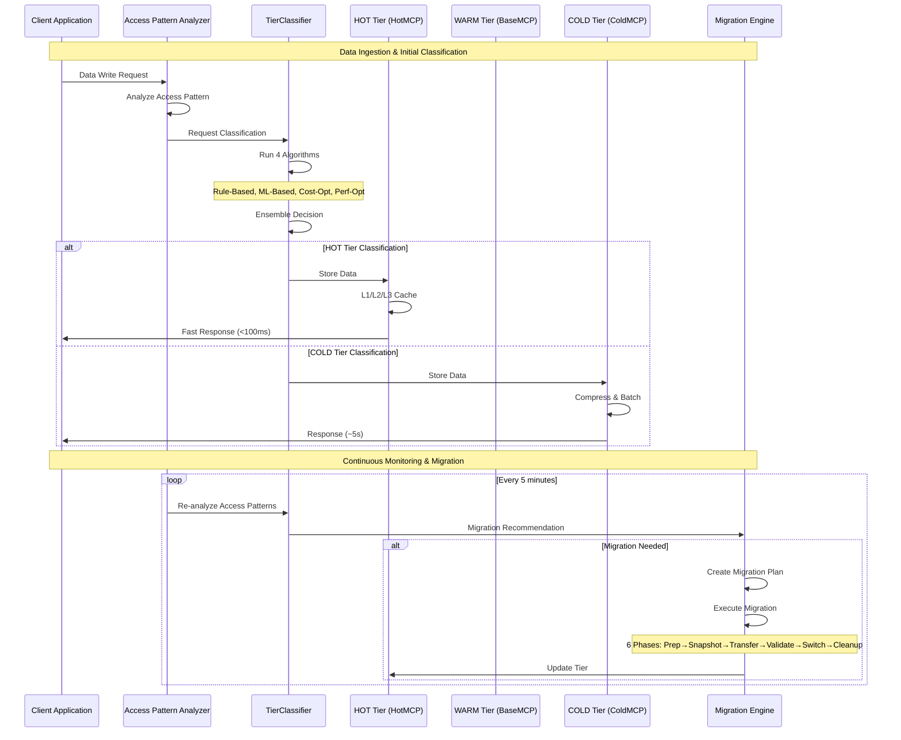
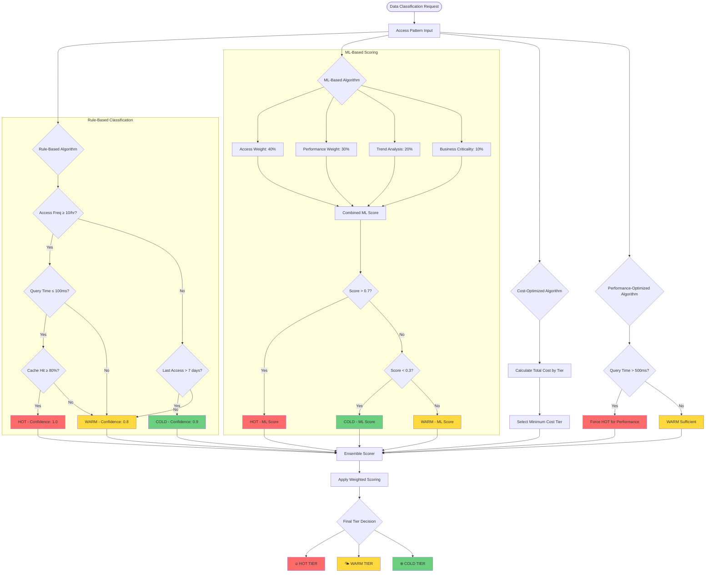
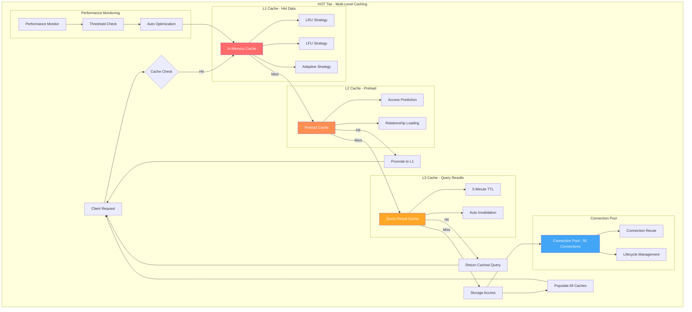
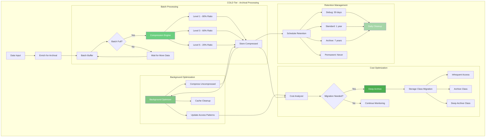
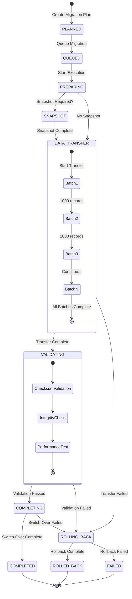
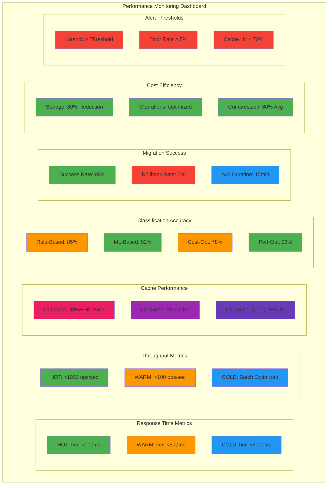
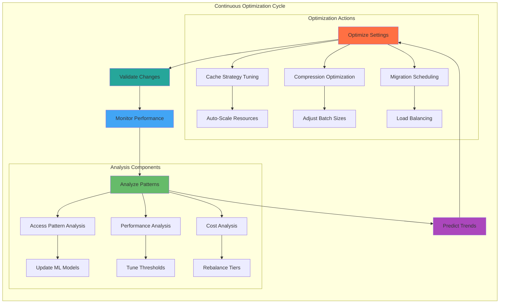

# Thermal Classification System - Technical Diagrams

## 🏗️ System Architecture Diagram

## 🔄 Data Lifecycle Flow

## 🧠 Classification Algorithm Decision Tree

## 🏎️ HOT Tier Caching Architecture

## ❄️ COLD Tier Processing Pipeline

## 🔄 Migration Process Flow

## 📊 Performance Metrics Dashboard

## 🎯 Optimization Feedback Loop

---

*These diagrams illustrate the comprehensive thermal classification system architecture, showing the intelligent data flow, multi-algorithm decision making, and continuous optimization processes that ensure optimal performance across all storage tiers.*