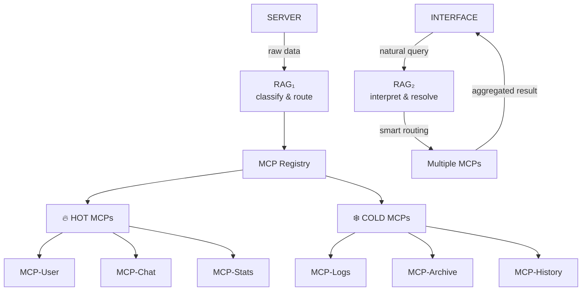
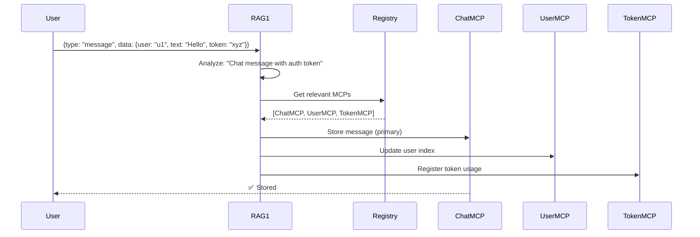
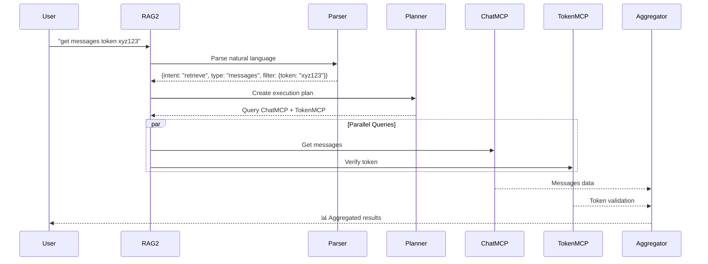

# 🚀 Build Enterprise Multi-MCP Smart Database System with RAG Intelligence

## 🎯 Mission

Build a **production-ready intelligent database system** that replaces traditional databases with a multi-MCP architecture. RAG₁ intelligently routes and structures data across multiple specialized MCPs, while RAG₂ interprets natural language queries to retrieve data without explicit SQL/query syntax.

## 🏗️ Architecture Overview



## 📋 Core Requirements

### 1. Type System (TypeScript)

```typescript
type MCPType = 'hot' | 'cold';
type MCPDomain = 'user' | 'chat' | 'stats' | 'logs' | 'archive' | string;

interface MCPMetadata {
  id: string;
  domain: MCPDomain;
  type: MCPType;
  accessFrequency: number;
  lastAccessed: number;
  recordCount: number;
  indexStrategies: string[];
}

interface NaturalQuery {
  raw: string;           // "get messages token xyz123"
  context?: any;         // optional context
}

interface InterpretedQuery {
  intents: string[];     // ["retrieve", "filter_by_token"]
  entities: {
    dataType: string;    // "messages"
    filters: Record<string, any>; // {token: "xyz123"}
  };
  targetMCPs: string[];  // MCPs to query
  aggregationStrategy?: string;
}
```

### 2. 🎛️ MCP Registry & Management

- **Central registry** tracking all MCP instances
- **Dynamic MCP creation** based on data patterns
- **Automatic HOT/COLD classification** based on access patterns
- **MCP migration** between HOT/COLD tiers
- **Load balancing** across MCPs
- **Health monitoring** and auto-recovery

### 3. 🗂️ Specialized MCP Types

| Type | Purpose | Examples |
|------|---------|----------|
| **Domain MCPs** | Specific data domains | User, Chat, Stats, Logs |
| **Temporal MCPs** | Time-based organization | Recent, Daily, Historical |
| **Pattern MCPs** | Frequent access patterns | TopUsers, ActiveChats |
| **Index MCPs** | Query optimization | TokenIndex, UserIndex |

### 4. 🧠 RAG₁ (Intelligent Ingestion & Routing)

- **Analyze** incoming data to determine optimal MCP placement
- **Create** new MCPs dynamically if patterns emerge
- **Distribute** data across multiple MCPs for redundancy
- **Maintain** cross-MCP indices for efficient querying
- **Learn** from access patterns to optimize routing
- **Classify** in real-time: HOT data → HOT MCPs, archive → COLD MCPs

### 5. 🔍 RAG₂ (Natural Query Interpreter & Resolver)

- **Parse** natural language queries without SQL
- **Identify** intent and entities from queries
- **Determine** which MCPs to query
- **Optimize** query execution plans
- **Aggregate** results from multiple MCPs
- **Learn** from query patterns to improve future routing
- **Cache** frequent query patterns

### 6. 💡 Smart Database Features

✅ **No schema definition required** - learns from data  
✅ **Automatic indexing** based on query patterns  
✅ **Self-balancing** across MCPs  
✅ **Predictive pre-loading** of likely queries  
✅ **Automatic archival** of cold data  
✅ **Cross-MCP transactions** support

## 🛠️ Implementation Steps

### Phase 1: Multi-MCP Foundation 🏗️

1. ✓ Implement MCP base class with common operations
2. ✓ Create MCP Registry with lifecycle management
3. ✓ Build specialized MCP types (UserMCP, ChatMCP, etc.)
4. ✓ Implement HOT/COLD classification logic
5. ✓ Create MCP migration mechanisms
6. ✓ Add inter-MCP communication protocol

### Phase 2: Intelligent RAG System 🤖

1. ✓ Build RAG₁ with ML-based classification
2. ✓ Implement dynamic routing algorithms
3. ✓ Create RAG₂ with NLP query parsing
4. ✓ Add query intent recognition
5. ✓ Build cross-MCP query optimizer
6. ✓ Implement result aggregation strategies

### Phase 3: Smart Database Features 🧠

1. ✓ Auto-indexing based on query patterns
2. ✓ Predictive caching system
3. ✓ Self-organizing MCP clusters
4. ✓ Query learning and optimization
5. ✓ Automatic data rebalancing
6. ✓ Performance monitoring dashboard

### Phase 4: Production Features 🚀

1. ✓ Distributed MCP support
2. ✓ Backup and recovery system
3. ✓ Real-time analytics on MCP performance
4. ✓ A/B testing for routing strategies
5. ✓ Query explanation system
6. ✓ Admin interface for MCP management

## 📁 Code Structure

```tree
/src
  /types
    ├── mcp.types.ts          # MCP-related types
    ├── query.types.ts        # Query types
    └── registry.types.ts     # Registry types
  /core
    /mcp
      ├── base_mcp.ts         # Base MCP class
      ├── hot_mcp.ts          # 🔥 HOT MCP implementation
      ├── cold_mcp.ts         # ❄️ COLD MCP implementation
      └── registry.ts         # MCP Registry
    /specialized
      ├── user_mcp.ts         # User-specific MCP
      ├── chat_mcp.ts         # Chat-specific MCP
      └── stats_mcp.ts        # Stats-specific MCP
  /rag
    /ingest
      ├── classifier.ts       # Data classification
      ├── router.ts           # MCP routing logic
      └── rag1.ts            # Main RAG₁ controller
    /query
      ├── parser.ts           # Natural language parser
      ├── planner.ts          # Query execution planner
      ├── aggregator.ts       # Result aggregation
      └── rag2.ts            # Main RAG₂ controller
  /intelligence
    ├── pattern_learner.ts    # Learn access patterns
    ├── index_optimizer.ts    # Auto-indexing logic
    └── cache_predictor.ts    # Predictive caching
  /api
    ├── server.ts             # Express server
    └── routes/
        ├── ingest.ts         # Data ingestion routes
        ├── query.ts          # Query routes
        └── admin.ts          # Admin routes
/tests
  /unit
    ├── /mcp
    ├── /rag
    └── /intelligence
  /integration
    ├── multi_mcp_flow.test.ts
    └── natural_query.test.ts
  /performance
    ├── load_test.ts
    └── query_benchmark.ts
```

## 🔄 Example Flows

### 📥 Data Ingestion Flow



### 🔍 Natural Query Flow



## 🧪 Test Scenarios

### Multi-MCP Tests 🔄

| Test | Description | Success Criteria |
|------|-------------|------------------|
| **Scale Test** | Create and manage 50+ MCP instances | < 1s creation time |
| **Migration Test** | Move data between HOT/COLD MCPs | Zero data loss |
| **Resilience Test** | Handle MCP failures gracefully | Auto-recovery < 5s |
| **Balance Test** | Distribute load across MCPs | Even distribution ±10% |
| **Consistency Test** | Cross-MCP data integrity | 100% consistency |

### Natural Query Tests 💬

> **Example Queries:**
> - ✅ `"show user activity last week"`
> - ✅ `"find all messages from john about project X"`
> - ✅ `"get stats for premium users in Europe"`
> - ✅ `"archive old logs but keep summaries"`
> - ✅ `"Complex aggregations across MCPs"`

### Performance Tests ⚡

- **Write Performance**: 10K writes/second distributed across MCPs
- **Query Latency**: Sub-50ms for 95th percentile
- **Auto-Rebalancing**: Automatic HOT/COLD rebalancing under load
- **Concurrent Access**: 1000+ concurrent queries across 20+ MCPs

## ✅ Success Criteria

| Metric | Target | Description |
|--------|--------|-------------|
| **Natural Language** | 100% | Zero SQL/explicit queries |
| **Self-Organization** | ✅ | No manual schema required |
| **Query Speed** | 10x | Faster than traditional DB |
| **Automation** | 100% | No DBA intervention needed |
| **Scalability** | ∞ | Seamless scaling via MCPs |
| **HOT Data Latency** | <100ms | For frequently accessed data |
| **Cache Hit Rate** | 90%+ | For repeated patterns |

## Deliverables
1. Multi-MCP smart database system
2. Natural language query interface
3. Performance benchmarks vs PostgreSQL/MongoDB
4. Auto-scaling documentation
5. Migration guide from traditional databases
6. Query pattern analytics dashboard

## Advanced Features (Future)
- Distributed consensus for multi-node MCPs
- Quantum-inspired query optimization
- Neural MCP networks for complex relationships
- Blockchain-backed audit trails
- Edge MCP deployment for IoT
- Federated learning across MCP clusters

Build this as a revolutionary database system that makes traditional databases obsolete through intelligent, self-organizing data management.